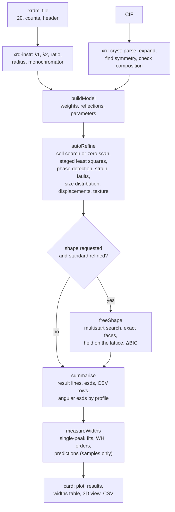

# How the Rietveld refinement works

The *Rietveld* card of the XRPD module refines powder patterns against crystal structures read from CIF files. It runs in the browser: nothing is sent to a server. This document describes the method as it is implemented. It covers:

- the model of the pattern;
- the least-squares solver;
- the staged strategy that takes a pattern from a CIF cell to a converged fit;
- the instrumental standard;
- the size, strain and fault broadening, by Lorentzian widths or by Whole Powder Pattern Modelling;
- the displacement parameters;
- preferred orientation and the crystallite-shape model;
- the single-peak width tests;
- what is reported, and with which uncertainties.

Each choice comes with its reason, and with the evidence it rests on where there is some. Most of that evidence is in the code's own comments and in the commit messages from v418 to v424.

The document follows the code as of v424. Functions are named with their file, e.g. `autoRefine` (`xrd-rietveld.js`), so that the references survive edits better than line numbers.

## Contents

1. [Overview](#1-overview)
2. [Inputs: the pattern, the instrument, the phases](#2-inputs-the-pattern-the-instrument-the-phases)
3. [The calculated pattern](#3-the-calculated-pattern)
4. [The parameters](#4-the-parameters)
5. [Least squares](#5-least-squares)
6. [The refinement strategy](#6-the-refinement-strategy)
7. [Instrument, size and strain](#7-instrument-size-and-strain)
8. [Displacement parameters](#8-displacement-parameters)
9. [Preferred orientation](#9-preferred-orientation)
10. [The free crystallite shape](#10-the-free-crystallite-shape)
11. [Weight fractions, cell volume, displacement](#11-weight-fractions-cell-volume-displacement)
12. [Peak widths and the tests that use them](#12-peak-widths-and-the-tests-that-use-them)
13. [The worker, the card and the exports](#13-the-worker-the-card-and-the-exports)
14. [Validation](#14-validation)
15. [Limits, and what could come next](#15-limits-and-what-could-come-next)
16. [Known issues](#16-known-issues)
17. [References](#17-references)

---

## 1. Overview

### 1.1 Using it

1. Load the patterns in the XRPD module (`.xrdml`), and mark the measurement of the instrumental standard (NIST SRM 660c LaB₆) as the standard.
2. Add each phase from a CIF (**+ CIF**). The standard's LaB₆ is built in.
3. Optionally, set per phase:
   - a preferred orientation (none, *best axis*, or a plane);
   - a crystallite shape (isotropic, or one of five solids);
   - the size profile (Lorentzian; WPPM, one size; WPPM, a log-normal distribution of sizes);
   - the microstrain (isotropic, or anisotropic after Stephens);
   - planar faults (none, or one of six kinds);
   - the displacement parameters (the CIF's; one ΔB; B per site; Uⁱʲ per site).
4. **Refine all** refines the standard first, then every sample with the standard's instrumental profile.
5. Read the results:
   - the result lines (with esds in brackets) and the warnings;
   - the pattern plot (observed, calculated, background, difference, ticks);
   - for samples, the peak-width table, the Williamson–Hall plot and the tests;
   - with a shape, the 3D view of the solid.

   Three CSV files export everything.

### 1.2 The modules

| File | Lines | Role |
|---|---|---|
| `xrd-data.js` | 450 | Reference tables: X-ray form factors (Waasmaier–Kirfel), anomalous dispersion (Chantler), atomic masses. |
| `xrd-cryst.js` | 1063 | CIF reading, symmetry from the atoms, conventional cells, reflection lists with multiplicities and absences, structure factors, the sites and the displacement parameters their symmetry allows. |
| `xrd-instr.js` | 328 | The instrument as the `.xrdml` header describes it. |
| `xrd-rietveld.js` | 2819 | The engine: the model, the profile, least squares, the staged strategy, preferred orientation, the free shape, sizes and weight fractions. |
| `xrd-broad.js` | 430 | Whole Powder Pattern Modelling (a line synthesised from its Fourier coefficients by FFT; the solids' common-volume functions; the log-normal average), Stephens' quartic invariants, the planar-fault table. |
| `xrd-rietveld.worker.js` | 400 | Runs a refinement off the main thread; formats the result lines and the CSV rows. |
| `xrd-widths.js` | 333 | Single-peak widths after the refinement; Williamson–Hall, order and prediction tests. |
| `xrd-rv.js` | 652 | The card: phases, options, runs, plots, results, state, exports. |
| `xrd-shape3d.js` | 1359 | The rotatable 3D view of a crystallite solid (2D canvas, no WebGL). |

The engine modules (`xrd-data`, `xrd-cryst`, `xrd-instr`, `xrd-broad`, `xrd-rietveld`, `xrd-widths`) are pure functions, with no DOM. The page, the worker and Node all import them, so they can be tested under Node (§14).

### 1.3 What happens on Refine



The standard's refinement produces the instrumental resolution function (*irf*): Caglioti U, V, W; Lorentzian X, Y; the axial-divergence asymmetry; the zero. Every sample refined afterwards takes it as its instrument.

### 1.4 Conventions

- **Angles.**
  - The data, the peak positions and all widths are in degrees 2θ.
  - θ in the formulas is the Bragg angle of the line, in radians where the code needs it.
  - All profile widths are **FWHM** unless a section says integral breadth (β).
- **Reciprocal length.** s = sinθ/λ = 1/(2d), in Å⁻¹ (the variable of form factors and Debye–Waller factors). Where the profile theory needs it, d\* = 1/d = 2sinθ/λ.
- **Units.**
  - Cell lengths in Å; crystallite sizes in nm.
  - B in Ų (B = 8π²U).
  - The specimen displacement is reported in mm.
- **Indices.**
  - (hkl) is a plane and its reflection; {hkl} is its family.
  - [uvw] is a lattice direction; ⟨uvw⟩ is its family.
  - All are given in the **conventional** cell, even when the CIF holds a primitive one.
- **Esds** are written as 3.9151(8): the value to the first significant digit of its esd (to the second when that digit is 1), with the esd in units of the last digit shown (`fmtEsd`, worker).

## 2. Inputs: the pattern, the instrument, the phases

### 2.1 The pattern and its weights

The XRPD module reads each `.xrdml` file into 2θ (an evenly spaced grid from the file's start and end positions) and intensities (`xrd.js`).

**Attenuator.** Points counted through the automatic attenuator are multiplied by their `beamAttenuationFactors`. Without that, the strongest peaks come out flattened, and their heights and widths with them.

**Variance multiplier.** Each point carries `varMul`, so that var(y) = y·varMul:
- the attenuation factor;
- divided by the counting time when the file holds a rate (cps).

`varMul` is attached when the file has attenuation factors or holds a rate; otherwise it is left out (1 throughout).

**What `buildModel` (`xrd-rietveld.js`) does with them:**
- **Descending scans.** A descending scan is held ascending internally: peak windows are found by bisection. Results are returned in the caller's order.
- **Bad 2θ.** A 2θ that is not a number throws, naming the point. A NaN would otherwise enter the background basis and every sum.
- **Missing counts.** A missing or non-finite count, or a non-positive `varMul`, gives the point zero weight.
- **Weights.**

  ```math
  \sigma_i^2 = \max(y_i, 1)\cdot \mathrm{varMul}_i ,\qquad w_i = 1/\sigma_i^2
  ```

  This is weighting by the observed counts, as GSAS and FullProf do. It pulls the fitted background about one count per point below the truth, because a point that fluctuates low gets more weight. At these count levels that is harmless, and the scales are unbiased.
- **Too few points.** Fewer than 10 weighted points (`MIN_POINTS`) is an error.

### 2.2 The instrument from the `.xrdml` header (`xrd-instr.js`)

**Reading the file.**
- The header is read by a small tolerant XML reader. A stray end tag closes back to its element or is ignored ("a header half-read beats none").
- It stops at the end of the first `<xrdMeasurement>`.
- A DOM entry point and a text entry point share the field logic through a five-function accessor, so the two cannot drift apart. The card uses the text one.
- Values the file does not give are left `undefined`, so `??` and `isFinite` read them as missing.

**What is read.**

| Item | Read from | Used by the model |
|---|---|---|
| Kα1, Kα2, Kβ, Kα2/Kα1 ratio | `usedWavelength` (else the anode's table, else Cu) | λ1, λ2, ratio |
| Anode | `anodeMaterial`, else the tube name (`… Cu LFF`) | defaults only |
| Goniometer radius | incident (else diffracted) beam path | the displacement in mm |
| Divergence slit | `xsi:type`, name, angle, or height at a distance | warnings, display |
| Incident Soller slit, filter | elements and names | display only |
| Anti-scatter slits, mask, diffracted Soller slit | elements and names | read, not used |
| Monochromator | any element named `*monochromator*`, either side | polarisation (LP) |
| Sample mode, scan axis | `xrdMeasurement`, `scan` | warnings |
| Detector | `detector` | display (its name) |
| Scan mode, counting time | `scan` | read, not used (the counting time for the weights is `xrd.js`'s own read) |

**Defaults, each with a warning shown on the card's instrument line.**

| Missing or invalid | Assumed |
|---|---|
| No wavelength | the anode's Kα1, Kα2, ratio 0.5. Cu's are as X'Pert Data Collector writes them (1.540598, 1.544426 Å); the other anodes' are Bearden's (*Rev. Mod. Phys.* 39 (1967) 78). Cu if the anode is unknown or has no table |
| λ1 but no Kα2 | a single wavelength (λ2 = λ1, ratio 0) |
| Ratio outside [0, 1] or missing | 0.5 |
| No radius | 240 mm (only the displacement in mm depends on it) |

**Geometries the model does not handle are warned about, not corrected:**
- a sample mode other than reflection;
- a scan axis other than the coupled θ–2θ (`Gonio`);
- an automatic divergence slit, whose intensities grow as sinθ against a fixed slit;
- a programmable slit with no irradiated length;
- an unknown or missing divergence slit, which is taken as fixed;
- an incident-beam monochromator with a Kα2 ratio, which usually passes Kα1 alone.

**What the model uses:** λ1, λ2, the ratio, whether there is a monochromator, and the radius. A file whose header cannot be read gives Cu Kα1/Kα2 at ratio 0.5, R = 240 mm and no monochromator ([Known issues](#16-known-issues)).

### 2.3 Phases from CIF files (`xrd-cryst.js`, `prepPhase` in `xrd-rv.js`)

**The parser** reads a CIF 1.1 subset, and accepts DDLm tag spellings (`_atom_site.fract_x`). Throughout, it refuses what would give a wrong pattern without an error, and warns where it assumes.

*Block, cell and operations.*
- **Block.** The first data block with fractional coordinates is used. A file holding more structures says which one was taken. A file with only Cartesian coordinates is refused.
- **Cell.**
  - Lengths must be positive.
  - An invalid angle becomes 90°, with a warning.
  - Angles that form no cell are refused (V must exceed 10⁻⁶·abc): 120/120/120° gives V = 0, and 60/60/130° a negative metric determinant.
- **Symmetry operations** come from `_space_group_symop_operation_xyz` or `_symmetry_equiv_pos_as_xyz`.
  - Each is parsed strictly. A misread operation would silently produce a wrong structure, so an operation with a non-integer rotation or |det R| ≠ 1 is dropped, with a warning. The file is read with the rest, and the group check then usually reports the list as incomplete.
  - Translations are snapped to multiples of 1/24 within 1.5·10⁻³, so that the absence test h·t ∈ ℤ stays exact.
  - A missing identity is added.
  - A list that is not a group is reported ("the list looks incomplete").
  - So is a centred symbol whose centring translations are missing.

*Sites.*
- Each site has a species, x, y, z and an occupancy.
  - Occupancy defaults to 1; over 1 is warned and kept.
  - Dummy atoms are skipped.
  - A species with no X-ray form factor is left out, with a warning.
  - An ion with no tabulated form factor falls back to the neutral atom.
- **B** is taken in this order:
  1. `B_iso_or_equiv`;
  2. 8π²·`U_iso_or_equiv`;
  3. the equivalent isotropic value of the anisotropic tensor (Fischer & Tillmanns), U_eq = ⅓ Σᵢⱼ Uⁱʲ a\*ᵢ a\*ⱼ (**a**ᵢ·**a**ⱼ);
  4. 0.5 Ų ("the usual guess for an inorganic solid at room temperature"), with a warning that lists the sites.

*Refusals.*
- **A named group whose operations are missing is refused.** Its sites are almost always the asymmetric unit only. Read as P1, they would fill the cell in part and give a wrong pattern with no error: rutile gives 2 atoms instead of 6, the cell found orthorhombic, and (211) the strongest line.
  - An operation list that holds the identity alone, x, y, z, counts as none.
  - With Z given, the test compares the atoms with the formula × Z.
  - Without Z, the formula is no evidence: Z would be inferred from the atoms, and an asymmetric unit that holds whole formula units would pass by construction. The atoms must then show by themselves the crystal system and the centring the symbol names, and, for a centrosymmetric group, a centre of symmetry (from the IT number, or from the symbol: a '/', −1 or −3, or an orthorhombic symbol of mirrors and glides). So NaCl named Fm-3m, given as Na and Cl, is refused (no F centring), and so is an asymmetric unit of P-1 in general positions (no inversion).
  - A lone special position can still pass, since a site alone in its cell shows the lattice's full symmetry: Mg named P6₃/mmc, given as one Mg, is read with one atom instead of two. A file that passes is read as P1 with a warning that the cell is filled only if all its atoms are listed.

**Filling the cell.** `expandAtoms` applies the operations to every site. Images closer than 10⁻³ on every axis are one position: "a special position written with three decimals, 0.333/0.667, yields images exactly 0.001 apart that are still one position". Duplicates are removed per site only, so two species sharing a site (a mixed occupancy) both stay.

**Composition check.** `checkComposition` compares two things:
- the site multiplicities, with `_atom_site_symmetry_multiplicity` where the CIF gives it;
- the cell's contents, with the formula × Z. Z is inferred from the most abundant element when the CIF omits it.

A mismatch is "the signature of coordinates written for one origin choice (or setting) read with the operations of another". For example, anatase I4₁/amd origin-1 coordinates with origin-2 operations give Ti₈O₁₆ instead of Ti₄O₈. When every element is off by the same factor, the message says so ("Z is wrong, or the coordinates belong to another origin choice"). H atoms the CIF lists in the formula but not in the sites (X-rays rarely locate them) are left out of the check.

### 2.4 Symmetry from the atoms

Whatever operations the CIF has, the engine uses the symmetry it finds in the filled cell (`findSymmetry`). The CIF's operations only fill the cell.

**Lattice symmetry** (`holohedry`).
- It collects every integer matrix with entries in {−1, 0, 1}, det ±1 and RᵀGR = G within 10⁻⁴ (relative). At most 48.
- Entries of ±1 suffice for reduced and conventional cells.

**Space-group operations.**
1. Atoms are grouped by species and occupancy (to three decimals). Empty sites are ignored, because they would lower the symmetry found.
2. The group with the fewest atoms supplies a reference atom x₀.
3. For each lattice symmetry R and each atom xⱼ of that group, the candidate translation is t = xⱼ − R·x₀ (snapped).
4. The operation is kept if every atom of every group maps within 0.01 Å onto an atom of its own group.
5. The distinct R form the point group. The pure translations give the centring: P, I, F, A, B, C, R, or X for anything else (a supercell).

**Crystal system.** It follows from the rotation orders:

| Rotations | System |
|---|---|
| ≥ 8 threefold | cubic |
| a sixfold | hexagonal |
| a threefold | trigonal |
| a fourfold | tetragonal |
| ≥ 3 twofold | orthorhombic |
| a twofold | monoclinic |
| none | triclinic |

**The constraint** decides how the cell is refined.
- In a standard setting, the usual free parameters are refined:

  | System | Free parameters |
  |---|---|
  | cubic | a |
  | hexagonal, trigonal (hexagonal axes) | a, c |
  | rhombohedral axes | a, α |
  | tetragonal | a, c |
  | orthorhombic | a, b, c |
  | monoclinic | a, b, c and the unique angle |
  | triclinic | all six |

- **A non-standard cell is refined through its conventional cell** (`conventionalBasis`).
  - This is the primitive cell of a centred lattice, as the Materials Project serves its P1 files.
  - Lattice vectors along the symmetry axes (indices up to ±3) become the columns of an integer matrix M. Then G_conv = MᵀGM and h_conv = h·M.
  - The atoms, operations and reflection list stay in the file's cell. Only the way its six parameters follow the refined conventional a, c (or a, b, c, β) changes.
  - Why: with one scale factor, a primitive cell "freezes c/a (and b/a, β) at the file's values: a DFT cell's wrong c/a then goes into the displacement and the widths". For a cubic phase, the refined a and V are those of the cube the tables quote.
  - Example: NaCl given as its primitive rhombohedral cell (a = 3.988 Å, 60°) is refined by the conventional a = 5.64 Å; M has |det| = 4.
- **Fallback.** If no conventional basis is found, the lengths are refined by one common scale factor (`isotropic`), which is always consistent with the symmetry, only less free.

**Reflections and ticks.** The reflections are listed in the file's cell, but their labels (the ticks, the tables) are given in conventional indices (`tickLabels`). Anatase's first line is then (101), not the primitive cell's (100).

### 2.5 The instrumental standard

The standard is built in: NIST SRM 660c LaB₆.

| Item | Value | Source |
|---|---|---|
| Space group | Pm-3m | |
| a | 4.156826 Å at 22.5 °C | the certificate |
| B on 6f (x, ½, ½) | x = 0.1992 | Eliseev et al., *Acta Cryst.* C42 (1986) 1263 |
| B_iso | La 0.25 Ų, B 0.35 Ų | typical values |

The displacement parameters are typical values because the standard's refinement gives the instrument's profile and zero, not its intensities.

- It is written in P1, only to be short. The symmetry found is cubic, order 48, and the composition check passes (LaB₆ × 1).
- Its cell is held at the certified value throughout. No thermal-expansion correction is applied to the laboratory's temperature.

## 3. The calculated pattern

### 3.1 The model

```math
y_c(2\theta_i) = b(2\theta_i) + \sum_{p} S_p \sum_{\mathbf h} \sum_{j\in\{\alpha_1,\alpha_2\}} w_j\, m_{\mathbf h}\, LP(\theta_{\mathbf h j})\, |F_{\mathbf h}|^2\, e^{-2\,\Delta B_p\, s_{\mathbf h}^2}\; T_{\mathbf h}\; \Phi\!\left(2\theta_i - 2\theta_{\mathbf h j}\right)
```

| Symbol | Meaning |
|---|---|
| b | the background (§3.9) |
| S_p | the scale of phase p (linear); it absorbs every constant, 1/V² included |
| **h** | the phase's reflections, one per Laue orbit |
| m_**h** | the multiplicity |
| w_j | 1 for Kα1, the Kα2/Kα1 ratio for Kα2 |
| LP | the Lorentz–polarisation factor (§3.4) |
| \|F_**h**\|² | the structure factor's squared modulus (§3.3), the atoms' displacements in it (§8) |
| ΔB_p | the phase's overall shift of the atoms' B, when its displacements are *one ΔB* (§8); 0 otherwise |
| s = 1/(2d) | as in §1.4 |
| T_**h** | the preferred-orientation factor (§9); 1 without one |
| Φ | the area-normalised peak profile, centred at the line's position (§3.5): the pseudo-Voigt of §3.6–3.7, or by WPPM the Fourier transform of the line's coefficients (§7.3) |

With a crystallite shape (§10), Φ becomes a sum over the members of each reflection's family. Each member carries its own width and its own texture weight:

```math
T_{\mathbf h}\,\Phi \;\to\; \sum_{i=1}^{m'} \frac{t_i}{m'}\, \Phi_i
```

Here m′ counts the members with ±**h** taken as one, and t_i is member i's texture weight.

With an anisotropic strain (§7.5) or planar faults (§7.6), each reflection has its own strain and fault broadening, the same for all members of its family.

Each phase's pattern is computed at scale 1 (`phasePattern`), and then:

```text
y_c = b + Σ_p S_p · pattern_p        (assemble)
```

When only linear parameters change (scales, background), only this sum is redone.

### 3.2 The reflection list

The list is made once, in `buildModel`, with `reflections` in `xrd-cryst.js`.

- **Down to:**

  ```text
  d_min = 0.9 · λ_max / (2 sin θ_lim),    θ_lim = min(89.9°, (2θ_end + 2°)/2)
  ```

  So it holds every reflection a cell up to 1/0.9 = 1.11× as large would bring into the range. The lattice lengths are bounded to ±10 % of the file's (`LAT_RANGE`). Because the list is fixed, the hkl and their multiplicities do not change while the cell moves.
- **Laue group.** The rotation parts of the operations and their negatives, so Friedel pairs merge.
- **Multiplicity.** The size of each orbit.
- **Representative.** The member with the fewest negative indices, then the largest: (110), (210), (221) as in the tables.
- **Enumeration box.** |h| ≤ ⌊|**a**|/d_min⌋, and likewise for k and l. This bound holds for any cell, however oblique.
- **Systematic absences.** A reflection is absent if some operation (R, t) with h·R = h gives a phase h·t that is not an integer within 0.02.
  - Allowed phases are integers; forbidden ones are at least 1/6 away.
  - Because the operations are the ones found, centring, screw axes and glides are all covered.
  - Accidental and site-specific absences stay in the list with F² ≈ 0. For example, Si (222) is listed with multiplicity 8.
- **Lines beyond the pattern.** A line outside the range is computed when its window reaches into it (§3.6). Towards 2θ = 180°, though, its widths and the Lorentz factor grow as 1/cosθ. Such a line lays a broad level over the whole pattern, and that level vanished at once when the cell carried the line past 180° (λ/2d ≥ 1). On a synthetic ZnO pattern measured to 130°, the refinement stopped on that step: the cell 20 esd from the truth, χ² 1.16 where the truth gives 1.02.
  - So lines beyond the pattern fade out between 2θ = 170° and 175° (`backFade`), smoothly, and the pattern stays continuous in the cell. When the pattern itself reaches past 169°, the fade starts 1° beyond its end.

### 3.3 Structure factors

```math
F(\mathbf h) = \sum_{j} o_j\, e^{-B_j s^2}\,\bigl(f_{0,j}(s) + f'_j + i f''_j\bigr)\, e^{2\pi i\,\mathbf h\cdot\mathbf x_j},
\qquad |F_{\mathbf h}|^2 = \tfrac12\bigl(|F(\mathbf h)|^2 + |F(-\mathbf h)|^2\bigr)
```

- **The sum** runs over every atom of the filled cell (o_j is the occupancy).
- **Bijvoet average.** A powder line holds both h and −h, which f″ makes unequal in a non-centrosymmetric structure.
- **f₀** is Waasmaier & Kirfel's five Gaussians plus a constant, valid for s ≤ 6 Å⁻¹.
  - It covers the neutral atoms H–Cf and 111 common ions.
  - An unknown species gives NaN, so a bad site shows up instead of silently scattering nothing.
- **f′ and f″** are Chantler's (NIST FFAST), tabulated at Cu Kα1, Cu Kα2, Co, Mo, Cr, Fe and Ag Kα1 for Z = 1–92.
  - The engine takes the line nearest λ1 within 0.002 Å.
  - It uses that line's values for Kα2 too.
  - Any other wavelength gets f′ = f″ = 0 rather than values for the wrong absorption edge.
- **Debye–Waller.** It acts on the amplitude, so F² carries e^{−2Bs²}. B_j is the CIF's (0.5 Ų where it gives none), or the refined B of the atom's site. With anisotropic displacements, the factor is e^{−**h**ᵀβ_j**h**} instead (§8.3).

**Speed** (`phaseGeometry`, `phaseF2`).
- The positions never move. So for each scattering type (one species, occupancy and B; with refined displacements, also one site and one orientation of it) and each reflection, the geometric sum Σ e^{2πi h·x} is made once.
- A new cell then costs only the form factors at the new s: no trigonometry. On a 48-atom monoclinic cell, the trigonometry had been most of the time of a cell-search step.
- F² is cached for the last cell and displacement parameters.

### 3.4 Lorentz–polarisation

```math
LP(\theta) = \frac{1 + \cos^2 2\theta_M \cos^2 2\theta}{(1 + \cos^2 2\theta_M)\,\sin^2\theta\,\cos\theta}
```

This is the Bragg–Brentano factor, divided by a constant (1 + cos²2θ_M) that the scale absorbs.
- **With a monochromator** (either side), 2θ_M is that of graphite (002), d = 3.3539 Å, at λ1. For Cu, 2θ_M = 26.56° and cos²2θ_M = 0.800.
- **Without one**, cos²2θ_M = 1.

No absorption, surface-roughness, sample-transparency or variable-slit correction is applied.

### 3.5 Peak positions

```text
2θ = 2·asin(λ_j / 2d) + zero + disp · cos θ
```

- `zero` (bounds ±2°) is the goniometer zero. It is refined on the standard only (§6).
- `disp` (bounds ±3°) is the specimen displacement term: Δ2θ = −(2s/R)·cosθ for a displacement s and a goniometer radius R. It is reported in mm as s = −disp·(π/180)·R/2.
- Each line has its own θ, so Kα2 sits where its own wavelength puts it.

### 3.6 The peak profile

**Widths.** For a line at Bragg angle θ:

```math
H_G = \sqrt{\max\!\left(10^{-8},\; U\tan^2\theta + V\tan\theta + W\right)},\qquad
H_L = (X + X_s)\tan\theta + \frac{Y + Y_s}{\cos\theta}
```

- **H_G** (Caglioti) and **H_L** are FWHM in degrees 2θ. U, V, W are in deg² and X, Y in deg.
- **Per phase.** X_s and Y_s belong to the phase: its strain-like and size-like Lorentzian broadening (§7). Lorentzian widths add under convolution, so the phase's simply add to the instrument's.
- **The floor.** H_G² never reaches 0, whatever U, V and W do (`HG2_FLOOR`). On the floor their derivatives vanish (§5.4).

**Pseudo-Voigt** (Thompson, Cox & Hastings 1987, `tch`). The pseudo-Voigt that best matches the Voigt of H_G and H_L has:

```math
H = \left(H_G^5 + 2.69269 H_G^4 H_L + 2.42843 H_G^3 H_L^2 + 4.47163 H_G^2 H_L^3 + 0.07842 H_G H_L^4 + H_L^5\right)^{1/5}
```

```math
\eta = 1.36603\,q - 0.47719\,q^2 + 0.11116\,q^3,\qquad q = H_L/H
```

η is clamped to [0, 1]; the cubic reaches 1.00000 at q = 1. With H_G = H_L = h, H = 1.635h.

**Area-normalised profile** (`addPeak`):

```math
\Phi(\delta) = \eta\left[\frac{2}{\pi H}\,\frac{1}{1 + 4\delta^2/H^2} - L_{\text{edge}}\right] + (1-\eta)\,\frac{2\sqrt{\ln 2/\pi}}{H}\,e^{-4\ln 2\,\delta^2/H^2}
```

- **Window.** It is evaluated within ±max(40·H, 1.5°) of the line (`WIN_FWHM`, `WIN_MIN`).
- **The Lorentzian is lowered by its own value at the window's edge** (L_edge), so it goes continuously to zero there. A Lorentzian still holds about 0.8 % of its area beyond 40 FWHM. Cut straight, it would leave a step at both ends of the window.
- **Not renormalised.** The intensity stays the area of the whole, untruncated peak, as a measured peak has it. What the window leaves out (1.6·η % at 40 FWHM, slow and almost flat) goes to the background, which follows it as it follows the data's own tails.
  - Renormalising inside the window instead had made the fitted intensities 1.6·η % low. Since η differs between phases, that biased their ratio.
- **The Gaussian part** is evaluated only where the exponent is under 40 (about ±3.8 H). It is zero long before the edge.

### 3.7 Axial divergence (Finger, Cox & Jephcoat 1994)

**Why.** A Bragg–Brentano peak is not symmetric. Rays that leave the diffraction plane along the goniometer axis meet each Debye cone at a slightly lower 2θ below 90° (and higher above), so low-angle peaks carry a tail towards low angles. On the user's LaB₆ a symmetric profile gave:
- R_wp 11.97 % and χ² 11.4;
- worse, a misfit that the zero, the displacement and the widths absorbed, and that the samples then inherit. Refined as a sample, LaB₆ came out at a = 4.156409 Å against its certified 4.156826 Å.

**The model** (`fcjNodes`).
- The sample's and the receiving slit's half-heights are taken equal. That leaves one parameter, A = (S + H)/L, as GSAS-II's SH/L. A two-parameter version (S ≠ H) refined its second parameter to zero on the standard.
- A ray leaving the plane by h·L meets the cone of 2θ at 2φ, where:

  ```text
  cos 2φ = cos 2θ · √(1 + h²)
  ```

- **Weight.** FCJ's weight, per unit of the axial offset h ∈ [0, A], is

  ```text
  W(h) ∝ (A − h) / ((1 + h²) · sin 2φ)
  ```

  This is finite at h = 0: in 2φ the same weight has an integrable singularity at the peak. So Gauss–Legendre quadrature in h converges fast.
- **The cut cone.** Below 2θ = atan A (and above 180° − atan A), the cone's tail ends at h_max = |tan 2θ| < A. There the weight has a 1/√(h_max − h) singularity, which the change of variable h = h_max(1 − u²) removes.
- **Size of the shift.** It goes as h², up to about −A²/2·cot 2θ. The centroid is at −A²/12·cot 2θ (radians).

**Nodes.** The profile is the weighted sum of the symmetric profile at the shifts d_k of the quadrature nodes.

| Case | Nodes used |
|---|---|
| The whole tail under 5 % of H (broad peaks, or near 90°) | 1 node at the mean shift |
| The tail under H/2 | 3 nodes: the Gauss quadrature of the discrete distribution of shifts (Stieltjes recurrence, then Golub–Welsch), exact for its first six moments; the profile is then within 0.007 % of the peak of the exact one |
| Otherwise | n = ⌈4·\|d_max\|/H⌉ + 2 Gauss–Legendre nodes, at most 300, so that neighbouring shifts lie within about H/4 of each other (the profile within 0.04 % of the exact one) |

Only a very sharp peak below about 12° (or above 168°) needs 300 nodes.

**Summing over the nodes** (`addPeakFCJ`).
- Each node is summed only over the peak's core, R = 1.5·spread + 6·H. Beyond that, one peak at the mean shift stands for them, blended in over 2·H so the profile stays continuous in the parameters.
- Out there, the shifted Lorentzians differ from the mean one by ½·var(d)·L″. That is under 2 % of a wing that is itself under 0.2 % of the peak; the profile stays within 0.005 % of the peak of the full node sum.
- A node per point over the whole window had made a large sharp cell refine 4.5× slower.

**Node counts are held during a refinement** (`lineNodes`, `fcjFreeze`). So χ² is a smooth function of the parameters: a count that changed with the widths or the asymmetry moved χ² in steps, and a derivative by up to 10×. See §5.6 for the audit that re-runs when the counts have been outgrown.

**The cell search** uses one node per line at the FCJ centroid. That is a quarter of the cost on a large sharp cell, and puts the minimum where the full profile puts it.

**Refined values.** A is refined on the standard only (§6), from 0.02 (`ASYM_START`): at 0 its derivative vanishes, since its effect goes as A². Samples take the standard's value through the irf. On the user's LaB₆:
- R_wp 7.62 %, χ² 4.62, (S+H)/L = 0.0583(1);
- refined as a sample, LaB₆ reproduces its certified cell to 1.5·10⁻⁵ Å.

### 3.8 Kα2

Kα1 and Kα2 are computed independently, each with its own:
- position;
- width (at its own θ);
- FCJ nodes;
- LP.

Kα2 is weighted by the file's ratio. The ticks and the reported peak data are Kα1's.

### 3.9 Background

```math
b(2\theta) = \sum_{k=0}^{6} c_k\, T_k(u) \;+\; \frac{c_{\text{inv}}}{2\theta},\qquad u = 2\,\frac{2\theta - 2\theta_0}{2\theta_1 - 2\theta_0} - 1
```

- **Chebyshev terms.** T₀ … T₆ over the whole pattern mapped to [−1, 1].
- **The 1/2θ term** (2θ in degrees; it takes up air scatter) is used by default when the pattern starts below 20°.
- **Linear.** All terms are linear parameters. c₀ starts at the 10th percentile of the counts.
- **Collinearity.** The 1/2θ term and the Chebyshev terms are nearly collinear. §5.3 says how the solver deals with that.

There is no separate amorphous term.

### 3.10 Agreement indices (`rStats`)

The sums run over the weighted points: N points, with P free parameters.

| Index | Formula |
|---|---|
| R_p | Σ\|y − y_c\| / Σ\|y\| |
| R_wp | √( Σw(y − y_c)² / Σw y² ) |
| R_exp | √( (N − P) / Σw y² ) |
| χ² (reduced) | Σw(y − y_c)² / (N − P) = (R_wp/R_exp)² |
| cR_wp | √( Σw(y − y_c)² / Σw(y − b)² ) |

cR_wp is R_wp with the background taken out of the denominator, which a high background otherwise flatters. The card shows R_wp, R_exp and χ². The others are recorded per stage.

## 4. The parameters

Every parameter has:
- a name;
- a start value;
- box bounds;
- a difference step for its Jacobian column;
- a flag for whether it is linear.

Which ones are free at each stage is decided by the strategy (§6).

**Global parameters**

| Name | Meaning | Start | Bounds | Linear |
|---|---|---|---|---|
| `zero` | goniometer zero, ° | 0 (the irf's for a sample) | ±2 | no |
| `disp` | displacement term, Δ2θ = disp·cosθ, ° | 0 | ±3 | no |
| `U`, `V`, `W` | Caglioti H_G² = U tan²θ + V tanθ + W, °² | 0, 0, (H_est/1.635)²; on a sample, the irf's (held) | U, W ∈ [0, 20]; V ∈ [−20, 20], and V's floor (§5.4) | no |
| `X`, `Y` | Lorentzian H_L = X tanθ + Y/cosθ, ° | 0, h·cosθ_E; on a sample, the irf's (held) | [0, 10] | no |
| `asym` | axial divergence A = (S+H)/L | 0.02 on the standard with ≥ 8 reflections in range (else 0, held); on a sample the irf's (0 without one) | [0, 0.2] | no |
| `bg0`…`bg6` | Chebyshev coefficients | 10th percentile; 0 | free | yes |
| `bgInv` | coefficient of 1/2θ | 0 | free | yes |

**Per phase** (prefix `p<id>.`)

| Name | Meaning | Start | Bounds | Linear |
|---|---|---|---|---|
| `scale` | S | 10⁻³ | [0, ∞) | yes |
| `a`, `b`, `c`, `alpha`, `beta`, `gamma` (as the constraint names them) | the conventional cell | the file's (conventional) values | lengths ±10 %; angles ±15° (within 1–179°) | no |
| `B` | ΔB, Ų (displacements *one ΔB*) | 0 | [−2, 10] | no |
| `B_<site>` | the B of one site, Ų (*B per site*, §8.2) | the mean of the CIF's B over the site (0.5 without) | [−2, 20] | no |
| `U11_<site>` … `U23_<site>` | the Uⁱʲ the site's symmetry leaves free, Ų (*Uⁱʲ per site*, §8.3) | isotropic, from the CIF's B | ±0.5 | no |
| `Xs`, `Ys` | the phase's Lorentzian broadening, ° (with WPPM, Y_s is the sphere's size, §7.3) | 0 and the excess width (§6.1) | [0, 10] | no |
| `S1`…`Sn` | Stephens' anisotropic parts of ε², 10⁻⁶ (§7.5) | 0 | ±10⁴ | no |
| `FA` | the planar faults' probability per plane (§7.6) | 0 | [0, 0.45] | no |
| `LS` | σ of ln D, the log-normal width (§7.4) | 0.3 and 0.6 (two starts) | [0, 1.5] | no |
| `PO` | March–Dollase r (only with a texture) | 1 | [0.2, 5] | no |
| shape widths `Ea Eb Ec`, `Wa Wc`, `Wd Wh`, `Wa Wb Wh`, `Wa Wb Wc` | the solid's dimensions as widths, ° (§10) | 0 | [0, 10] | no |
| `R1 R2 [R3]` | rotation vector of the solid, rad | 0 | ±4; largest step 0.4 per iteration | no |
| `Q0`…`Q3` | the reference orientation (a quaternion) | 1, 0, 0, 0 | never refined | — |
| `L11`…`L33` | the v420 ellipsoid (legacy) | 0 | ±10 | no |

**Housekeeping.**
- A start outside its bounds is clamped in (`clampInto`). A hand-typed or stale value could otherwise leave a parameter where it has no effect at all: Ys = −0.2 makes H_L = 0 everywhere, and the refinement would never bring it back.
- A NaN that went through JSON (a saved session, a worker message) comes back as null. Only finite numbers are taken from a parameter object.

## 5. Least squares

The solver is `refine` / `refineHeld` (`xrd-rietveld.js`): Levenberg–Marquardt, with a handful of additions that came from failures on real and synthetic data.

### 5.1 The normal equations

```math
\chi^2 = \sum_i w_i\,(y_i - y_{c,i})^2,\qquad A = J^\top W J,\qquad g = J^\top W (y - y_c)
```

**Jacobian columns.**
- **Linear parameters: exact.** A scale's column is its phase's pattern at scale 1. A background term's column is its basis function.
- **The others: central differences** with step h = max(step, 10⁻⁷·|v|).
  - The difference is one-sided at a bound, so the model is never evaluated outside its box.
  - A column touches only the phases the parameter acts on. A phase whose scale is 0 contributes nothing.

**Scaling.** Each step is solved on the correlation-scaled matrix:

```text
A_s = D⁻¹ A D⁻¹,   D = √diag(A)
```

Every pivot is then relative to its own column's size, and parameters in Å, degrees and counts mix without trouble.

**Damping.**

```math
(A_s + \lambda I)\,\delta_s = g_s,\qquad \delta = D^{-1}\delta_s
```

This is Marquardt's diagonal damping. λ starts at 10⁻³.

- **Accepted step** (any decrease of χ²): λ → max(λ/10, 10⁻⁹).
- **Rejected step:** λ → 10λ.
- Up to 12 tries per iteration.
- The Cholesky factorisation drops a pivot below 10⁻¹⁰ of its diagonal: that parameter is numerically a combination of the others. Its step is then 0 and its variance NaN.

**Convergence.** The refinement stops when any of these holds:
- every applied shift is under 1 % of its esd;
- χ² falls by less than 10⁻⁹ (relative);
- no step lowers χ²;
- nothing can move;
- `maxIter` is reached (40 per stage; 60 for the shape's full refinements; 8 for its brief trials; 4 inside the angular profiles).

### 5.2 Bounds

**Box bounds.**
- A step is clamped component by component into the box.
- A parameter on a bound whose gradient points outwards is held for that iteration and re-tested at the next.
- The step is only clamped into the box (and, with V free, projected onto V's floor, §5.4). It is not recomputed on the parameters left free, and there is no line search: a trial step is accepted or rejected on χ² alone.

### 5.3 Linear parameters

**Inside Levenberg–Marquardt,** the scales and background terms are ordinary free parameters, with exact columns.

**When the iterations stop,** the free linear parameters are also solved exactly with the others held (`linSolve`, up to 3 times). If that lowers χ² by more than 1 % of χ²_ν, the iterations resume.

Why: the 1/2θ term and the Chebyshev terms are nearly collinear. Along that direction a damped step is cut to almost nothing, while its shift is still far under 1 % of its (large) esd. The refinement then stopped with χ² up to 17 above its minimum on synthetic plates, all of it in the background. That gap had made the shape's starts seem to reach different minima.

**`solveLinear`** solves the scales and background by weighted linear least squares. A negative scale is set to 0 and the rest solved again (up to 4 passes). It also serves:
- every point of the cell and zero scans (§6.2–6.3);
- the linear start of every refinement.

### 5.4 The Gaussian-width floor and V

**The problem.** H_G² = U tan²θ + V tanθ + W can be pushed to 0 at some reflection by a negative V. There the width sits on its floor (H_G ≥ 10⁻⁴°), where the U, V, W derivatives vanish. That is a plateau the refinement cannot leave. From moderate starts, a third of the LaB₆ runs ended there, reported as converged at a χ² 12 % too high.

**The fix.** When V is free, its lower bound follows U and W (`vFloor`): the lowest V that keeps the quadratic ≥ 0 over the pattern's tanθ range. That is −min(U t + W/t) over the range, or −2√(UW) where the minimum lies inside it. Every trial step is projected onto it.

**At the end,** H_G² may be on or near the floor (within 100× it, H_G ≤ 10⁻³°) at a reflection in range of a phase present. Then the free U, V and W have no meaningful curvature, and each of them is listed `atBound` with esd NaN.

### 5.5 Steps that a symmetric orientation makes unbounded

The crystallite solid's orientation is a rotation vector (§10.4).

**The problem.** Where a turn has no first-order effect (an axis on a symmetric direction, where the members' changes cancel over a family), the Gauss–Newton step is unbounded. A first step of 4 rad threw a disc's axis anywhere.

**What did not work.** Shortening the whole step instead froze every other parameter with a turn whose column was numerical noise: a sphere's sizes stopped 30 % off.

**What the solver does.**
- **Clamp per component.** Each turn component has a largest step, 0.4 rad (`maxStep`), applied to that component alone.
- **Retry without it.** When a trial with a clamped turn does not lower χ², the same step is tried again without the clamped turns.
  - At a kink of χ² (a faceted body exactly on a symmetric orientation), the turn's column is noise, and its step stays over the limit however large λ grows. Every trial carried it, and the refinement stopped with every other parameter frozen. A cylinder's sizes were 30 % off, and the angular profiles of held solids 3–5× too narrow.

### 5.6 Holding the FCJ node counts

**Held during a pass.** `refine` holds every line's FCJ node count fixed for the whole of a pass (§3.7), so χ² is smooth in the parameters.

**The audit.** At the end of a pass, it checks whether any line has outgrown its count:
- a count of 1–3 nodes now needing more;
- a larger count now needing over 1.25× as many.

If so, it refines again with fresh counts, up to 4 passes. A count a quarter short still leaves the profile within about 0.1 % of the peak, so a line that moved by a node or two is no reason to start again.

**Why.** The asymmetry, freed from 0.02, went to 0.058 on the user's standard. Its tails were then 8× longer than the counts were made for, and χ² was 8 % off at the end.

**Exception.** The free shape's brief trials (which only rank starting shapes) and the angular profiles run a single pass.

### 5.7 Esds, covariance, correlations

At the solution, the solver recomputes the Jacobian:

```math
C = (J^\top W J)^{-1}\,\chi^2_\nu,\qquad \sigma_j = \sqrt{C_{jj}},\qquad \rho_{jk} = \frac{C_{jk}}{\sqrt{C_{jj}C_{kk}}}
```

χ²_ν = χ²/(N − P), counting every free parameter. It multiplies the covariance unconditionally, so it also shrinks the esds when χ²_ν < 1.

**Parameters on a bound are kept in the covariance.** Held there, such a parameter would make the esds of the ones correlated with it conditional, and too small. In synthetic tests, the sizes of runs whose strain sat at 0 missed the truth by up to 3.8 of those esds. Kept, it makes them somewhat large instead: in Monte Carlo runs where the strain sat on 0 in about half the realisations, the size's esd was 1.3× its true scatter, the safe side. Its own esd is the curvature's, as if the bound were not there. It is listed in `atBound`, for the reader to take the value as a limit.

**A parameter with no effect on the pattern,** or numerically a combination of others, gets esd NaN and is listed as `undetermined`.

**What the esds are.** They are those of linear least squares at the minimum, with the residuals taken as independent:
- They do not include the serial correlation that a systematic misfit gives the residuals (no Bérar–Lelann or Durbin–Watson correction). See §15.
- They do not include the uncertainty of anything held: the instrument from the standard, the atoms' positions and B, the wavelength.

## 6. The refinement strategy

`autoRefine` takes a pattern from the CIF's cell to a converged fit in stages. Each stage frees more parameters than the last, and each starts from where the previous one ended.

### 6.1 Starting values

**Width estimate** (`widthEstimate`). The FWHM of the strongest peak:
- on the counts smoothed over 3 points;
- above a local background, the 10th percentile within ±4°;
- with the half-maximum crossings interpolated linearly.

θ_E is that peak's angle.

**Without an irf** (the standard, or a sample before any standard is refined):
- h = H_est/1.635 (H_G = H_L = h gives H = 1.635h under TCH);
- W = h², Y = h·cosθ_E;
- U = V = X = 0.

**With the standard's irf:**
- U, V, W, X, Y, the asymmetry and the zero are the standard's.
- Each phase starts with Y_s = max(0, H_est − H_inst(θ_E))·cosθ_E and X_s = 0: the sample's width above the instrument's, all of it Lorentzian to start with.
- By WPPM, Y_s starts 1.23× lower: a sphere's own profile is 1.23× as wide as the Lorentzian of the same Y_s (§7.3).

**Asymmetry.** On the standard, A starts at 0.02 when the pattern holds at least 8 reflections in range; otherwise it is held at 0. On a sample it is the irf's (0 without one).

### 6.2 The standard: a zero scan

**The zero scan.**
1. The zero is scanned over ±0.3° in steps of max(H_est, 0.02°)/4. At each point the scales and background are solved exactly, with the FCJ collapsed to its centroid.
2. A minimum inside the range is placed by a parabola through its three points, so the value found does not carry the grid's step.
3. A minimum on the edge, or a flat curve, leaves the zero where it was, with a warning.

**Then,** the cell is held at the certified value, and the stages free:
1. the scales and background;
2. the zero and displacement;
3. W and Y;
4. X, U, V and the asymmetry (the full profile) when at least 8 reflections lie in range; otherwise X alone.

### 6.3 A sample: the cell search

A sample's cell may be a few per cent off the file's: a doped phase, a DFT cell, a different temperature. Its peaks must be found before least squares can refine anything: a peak that does not overlap its own model gives no gradient towards it.

**The scan** (`cellSearch`). All the phase's cell lengths are scaled by a common factor f (angles and axial ratios kept). R_wp is scanned over f ∈ [1 − 0.03, 1 + 0.03]. At each point:
- the other phases are held;
- the scales and background are solved exactly;
- the FCJ is collapsed to its centroid.

**The step.** Scaling the lengths by δf shifts a line by Δ2θ = 2tanθ·δf, so the step is

```text
δf = H(θ_max)·π/180 / (3 · 2 tanθ_max)        (H in degrees)
```

This keeps the shift of the last peak in the range below a third of its width, so the minimum cannot fall between grid points.

**The grid.**
- **Single pass.** When that needs at most 161 points, one pass of at least 41 points.
- **Two passes,** otherwise:
  - **Coarse pass.** 81 points. Every peak is widened (W raised by H_c², H_c being the width whose third the coarse step moves the last peak by). Windows shrink to ±10 FWHM: ±18° windows on a large cell had made this pass most of the search.
  - **Fine pass.** It runs around the coarse minimum, with the true profile.

  Examples:

  | 2θ_max | H(θ_max) | Grid |
  |---|---|---|
  | 80° | 0.1° | a single pass would need 175 points (> 161): two passes, 81 coarse + 11 fine |
  | 130° | 0.5° | one pass of 91 points |

- **Ties.** Points within 10⁻⁹ (relative) are a tie, broken towards f = 1. A phase whose scale solves to 0 everywhere leaves a flat curve, whose first point (the edge of the range) would otherwise win.
- **Placing the minimum.** It is placed by a parabola.

**No minimum inside the range** (on the edge, or flat) leaves the phase's cell where that search started it, with a warning: the file's cell, or the first-round cell for a phase found in the first round but not in the second. Its lattice is then held through the refinement. Why:
- An edge minimum only starts a walk to the lattice bounds. Most often it means a candidate phase that is not in the sample: an absent rutile, anatase or ZnO next to SrTiO₃ had taken up to 74 wt % that way.
- An absent LaB₆ had moved 5.7 % off its cell to sit under SrTiO₃'s peaks.

**Several phases** are searched in two rounds, each phase with the others held. A phase scanned while another still sits at its CIF cell can be drawn to that one's peaks. Only the phases found in the first round are searched again: twice round, an edge minimum compounded to 0.97² = 0.94.

**A lone phase not found** is searched once more over ±6 %. With no other phase to be confused with, the search may go wider at no risk.

**Then the stages free:**
1. the scales and background;
2. the lattice (angles included, except for phases not found) and the displacement. A sample's zero is never refined: it is the standard's (0 without one);
3. with an irf, each phase's Y_s; without one, W and Y;
4. with an irf, each phase's X_s ("size and strain"); without one, X ("profile shape"), with U, V and the asymmetry held at 0.

### 6.4 Is each phase in the sample?

A candidate phase that is not in the sample still takes what misfit its peaks can reach, and bends the other results. Before the detection tests existed:
- an absent LaB₆, held at its cell with the starting widths, came out at 2.9 esd yet 35(8) wt %;
- a broad absent NaCl, its strong lines within 0.6° of SrTiO₃'s, took 40 wt % of a SrTiO₃ pattern by fitting the tails a single crystallite size leaves.

Two tests decide, and a phase that fails is **left out**: scale 0, its cell back to the file's (for its ticks), and nothing of it refined further.

1. **Its scale must stand above 3 esd.** This is tested after the first stage, and again after the last.
2. **It must have intensity of its own** (`ownEvidence`, when several phases are present).
   - **Its own region.** These are the points where the phase holds at least 2/3 of the calculated Bragg intensity (and more than 2 % of its own maximum).
   - **The fit there:** y − y_c + P = α·P + c₀ + c₁(2θ − 2θ̄), with P the phase's calculated pattern. The straight line takes up what the background could.
   - **Reading α.** A phase present gives α ≈ 1; one that is not has no such region, or α ≈ 0 in it.
   - **The test.** The phase must have at least 5 % of its intensity in such regions, and α > 3 esd.
   - **Why the 2/3 threshold:**
     - an absent NaCl has 4 % of its intensity there (26 % at a ½ threshold, enough for the tails a single size leaves to pass for it);
     - a synthetic 5 wt % rutile has 42 %, at α = 1.05(9). It is found every time beside nanocrystalline SrTiO₃;
     - 2 wt % rutile comes out at 0.9(4), not told from 0.

**Restart.** A phase that fails a test at the end of a pass is left out, and the stages are run again from the cell search's result without it.
- Every phase whose scale is not above 3 esd goes at once.
- Only when none fails that test is the own-intensity test applied. Then one phase goes per pass: the one with the least intensity of its own. None goes when no phase has a region of its own.
- Phases that fail the 3-esd test after the first stage are dropped in that same pass, without a restart.

**Two copies of the same CIF** (the same lattice type and number of atoms in the cell, the cell mass within 0.1 %, and a, b, c each within 2 %) count as one phase in this test. That allows two size populations of one phase.

**Warnings** say why a phase was left out, e.g. "…85 % of its calculated intensity lies under SrTiO₃'s peaks, and no part of the pattern is its own". When the phases overlap throughout, the warning says that their fractions are not told apart.

### 6.5 Optional stages

After the four stages, the phases' options add stages, in this order. Each frees its parameters on top of everything already free:
1. **Anisotropic strain** (§7.5): Stephens' S_j. ε² = ε₀² + Σ S_j q_j has no derivative at ε₀ = 0 where it is clipped, so X_s is first raised to at least 0.02°.
2. **Planar faults** (§7.6): the fault probability, from 0.
3. **Size distribution** (§7.4): σ enters the profile to second order (a distribution and its mirror in ln D differ only beyond), so from σ = 0 it has no derivative. It is refined from 0.3 and from 0.6, and the lower χ² is kept.
4. **Displacement parameters** (§8): ΔB, the B per site or the Uⁱʲ per site.
5. **Preferred orientation** (§9).

Then, separately, the **free crystallite shape** (§10).

**The standard's profile is required** by WPPM, the anisotropic strain and the faults. Without it, the instrument's broadening and the sample's are one and the same. A phase that asks for them without it is refined without them, with a warning; the result's `models` says what each phase was refined with.

### 6.6 What a refinement returns

`autoRefine` returns:
- the parameters with their esds, covariance and correlations;
- the free list, `atBound` and `undetermined`;
- the statistics;
- a record per stage (R_wp, R_exp, χ², R_p, cR_wp, free parameters, iterations, convergence, time);
- the cell-search curves;
- per phase: size and strain, weight fraction, detected or not;
- the warnings;
- the shapes kept, with their search record;
- the textures;
- the models each phase was refined with (`models`: size profile, strain, faults, displacements), from which the card draws the result again;
- the isotropic fit's parameters (when a shape was kept);
- the number of reflections in range.

## 7. Instrument, size and strain

### 7.1 From the standard to the samples

**The irf.** The standard's refined U, V, W, X, Y, asymmetry and zero are passed to every sample. That sample's U … asymmetry and zero are then held at the standard's values. The irf in use is stored with each sample's result.

**What it includes.** The standard's own broadening (LaB₆ SRM 660c is large-grained and nearly strain-free) is part of the irf. Its uncertainty is not propagated into the samples' sizes.

**What it assumes.** That the samples were measured with the same optics, wavelength and 2θ range. Nothing checks this. Outside the standard's range, the Caglioti quadratic is extrapolated.

### 7.2 Size and strain from the Lorentzian widths (`sizeStrain`)

With an irf, every phase's broadening above the instrument is Lorentzian:

```math
H_{L,\text{sample}} = X_s \tan\theta + \frac{Y_s}{\cos\theta}
```

The size term goes as 1/cosθ, the strain term as tanθ:

```math
D = \frac{K\lambda_1}{Y_s\,\pi/180},\quad K = 0.9;\qquad
\varepsilon = \frac{X_s\,\pi/180}{4}\quad\left(H_{L,\varepsilon} = 4\varepsilon\tan\theta\right)
```

- D is reported in nm, with λ1 the Kα1 wavelength.
- **Esds.** σ_D = D·σ_Ys/Y_s, and σ_ε = σ_Xs·(π/180)/4. Both come from the refinement's covariance, without the irf's uncertainty.
- **No broadening.** Y_s = 0 gives "no measurable broadening" (D = ∞).
- **Without an irf,** the whole Lorentzian width Y is used, the instrument's included, and the card says so. All phases then share one profile.

**The calibration K = 0.9 applied to the Lorentzian FWHM** (on Scherrer's constant, Langford & Wilson 1978) matches the Scherrer sizes of the XRPD Analysis card, so the two can be compared. It is a convention, not the Stokes–Wilson size of a sphere:
- A sphere's volume-weighted column length is ⟨L⟩_V = 3D/4.
- For a Lorentzian, the integral breadth is β = (π/2)·FWHM.
- So that relation gives D = 8/(3π)·λ/(FWHM·cosθ) = 0.849·λ/(FWHM·cosθ).

The reported D is therefore about 6 % above that. With the true profile of a sphere (FWHM·D·cosθ = 1.107 λ, §7.3), it is about 19 % below the diameter: the true diameter is 1.107/0.9 = 1.23× the reported D. All sizes in the card (isotropic, shape dimensions, single-peak widths) use the same K, so their ratios are free of this choice.

**No Gaussian sample broadening is modelled.** A sample can never come out narrower than the standard (Y_s, X_s ≥ 0).

**Other profiles.** The size can instead be modelled by WPPM (§7.3), with one size or a log-normal distribution (§7.4); the strain can depend on the direction (§7.5); planar faults add their own broadening (§7.6).

### 7.3 Whole Powder Pattern Modelling (`wppmLine`, `xrd-broad.js`)

**Why.** A Lorentzian of the right breadth is the profile of a broad, exponential distribution of column lengths (§7.2). A single solid's profile has another shape:

| Profile | FWHM/β | ⟨L⟩_A/⟨L⟩_V |
|---|---|---|
| Lorentzian | 0.637 | 0.5 |
| sphere | 0.830 | 0.89 |
| slab, all columns equal (profile T·sinc²) | 0.886 | 1 |

At equal breadth β, the slab's tails are half the Lorentzian's: they go as 1/(2π²s²⟨L⟩_A). With the Lorentzian model, that difference goes into Y_s, the background and the sizes. Whole Powder Pattern Modelling (Scardi & Leoni 2002) takes each cause of broadening by its Fourier coefficients instead. The profile is the transform of their product.

**The coefficients.** A line is synthesised in δ = d\* − d\*₀ (Å⁻¹), where a size profile is symmetric whatever the angle:

```math
A(L) = \Bigl[\eta\, e^{-\pi H L} + (1-\eta)\, e^{-(\pi H L)^2/(4\ln 2)}\Bigr]\; e^{-\pi W_L L}\; A_S(L)\; \sum_k w_k\, e^{-2\pi i L \delta_k}
```

| Factor | What it is |
|---|---|
| H, η | the instrument's pseudo-Voigt at the line, from the standard's U … Y (TCH, §3.6), H converted to d\* (×cosθ·(π/180)/λ) |
| W_L | the Lorentzian terms' FWHM in d\*: 2εd\* for the strain (4ε·tanθ in 2θ) and κ/π for the faults (§7.6) |
| A_S(L) | the crystallites' common-volume function: the fraction of a crystallite's volume that its copy shifted by L along the diffraction vector still overlaps |
| δ_k, w_k | the axial divergence's nodes (§3.7), as shifts in d\* |

**The size factor** (`covBase`, `addMemberCoef`). For the base bodies, with ℓ the shift in their units:
- ball (diameter 1): 1 − 3ℓ/2 + ℓ³/2;
- cube (edge 1): (1 − ℓa)(1 − ℓb)(1 − ℓc), with a, b, c the direction's absolute components;
- cylinder (diameter 1, height 1): (1 − ℓc)·(2/π)(acos ℓs − ℓs·√(1 − ℓ²s²)), with s the component across the axis and c along it.

Without a shape, the body is a sphere of diameter D. With a free shape (§10), each member of the family has its own: the base body along that member's direction, at ℓ = L·|**t**|·(π/180)/(Kλ₁), **t** = **W** ∘ (Rotᵀ**u**) as in §10.3. An ellipsoid, a spheroid and an elliptic cylinder are affine images of the ball and the cylinder, so their factors are exact too. The members are averaged with their texture weights.

**The parameter.** Y_s stays the parameter, read as D = Kλ₁/(Y_s·π/180): the same conversion as the Lorentzian model's, but here D is the sphere's diameter itself, not a Scherrer size. At equal Y_s, a sphere's own profile is 1.23× as wide as the Lorentzian (FWHM·D·cosθ = 1.107λ), so a WPPM refinement starts Y_s 1.23× lower (§6.1). A solid's widths likewise read as its true dimensions, with no calibration (§10.3).

**The synthesis.** The coefficients are laid on a grid and transformed by a radix-2 FFT:
- **The window** is ±max(40·H_est, 1.5°) about the line, plus the divergence's spread, as for the pseudo-Voigt (§3.6). One period of the transform is the window.
- **The grid step** Δδ is an eighth of the narrowest component's FWHM. With a size distribution, that is the largest crystallites' (e^{3σ − σ²/2} times the mean). N is a power of 2, between 64 and 16 384.
- **The coefficients** are computed out to where the instrument's and the Lorentzian terms' product falls under 10⁻⁸.
- **The edge.** Periodicity folds the tails beyond the window back in. So the profile is lowered by its value at the window's edge, the same point on both sides: it goes to zero there continuously, and what it leaves out goes to the background. This is the pseudo-Voigt's treatment (§3.6).
- **Reading it.** At each point of the pattern, δ(2θ) = 2(sinθ − sinθ₀)/λ. The profile is read by cubic (Catmull–Rom) interpolation and multiplied by the Jacobian cosθ·(π/180)/λ, so its area in 2θ is the line's intensity.

**Checks.**
- Against a direct quadrature of the same transform, the synthesised profile agrees to 0.03 % of the peak.
- On Lorentzian-like profiles, a WPPM line's area in the window is about 0.3 % below the pseudo-Voigt's at the same intensity. The periodic folding makes the pedestal taken off at the edge a little larger. Weight fractions between a WPPM phase and a Lorentzian one carry that bias.

**Cost.** On a synthetic SrTiO₃ pattern (2θ 15–120°, 5251 points), a sphere refines in about 3 s, a log-normal distribution in 8–16 s, and a free cylinder in 35–50 s. A free solid with log-normal sizes takes minutes: about 5 on the user's 33A. A broad distribution holds large crystallites whose narrow profiles set the grid, and every trial shape of the search pays for it. The log-normal average of a cylinder or a box is tabulated in ln ℓ₀ every σ/10 for each member and read by cubic interpolation (to 4·10⁻⁶); computed point by point, that case took 17–23 minutes.

**Needs the standard's profile** (§6.5). Without it, H and η would hold the sample's broadening too.

### 7.4 A log-normal distribution of sizes

**The model** (Scardi & Leoni 2001; Langford, Louër & Scardi 2000). Spheres (or the free solid scaled as a whole) with a log-normal distribution of sizes, of width σ in ln D (`LS`). A crystallite of relative size s diffracts as s³, so over the volume ln s is normal with mean 3σ² and variance σ² (relative to the median). The size factor is the average of the body's over that distribution (`lnAverage`):

```math
A_S(L) = \int a\!\left(\frac{L}{s D_m}\right)\, \phi_V(\ln s)\, d\ln s
```

**The quadrature.** In u = ln ℓ, the integrand is smooth on the body's support. Gauss–Legendre with 24 nodes over [μ − 7σ, min(ln T, μ + 7σ)] converges fast. The mass below μ − 7σ (about 10⁻¹²) is taken as a = 1. The average depends on L·scale alone. The sphere's is tabulated once per σ, on 2048 points even in ln ℓ, and interpolated. A cylinder's or a box's depends on the member's direction too: for a long line it is tabulated per member every σ/10 in ln ℓ over the line's reach, and read by cubic interpolation (to 4·10⁻⁶ of the value computed point by point).

**What the dimensions mean.** The parameter Y_s (or a solid's widths) gives the *volume-weighted mean* crystallite, ⟨D⁴⟩/⟨D³⟩ for spheres, which is e^{3.5σ²} times the median. The integral breadth, which ⟨L⟩_V sets, then stays with the size while σ changes the profile's shape. With the median as the parameter instead, σ and the size traded one for the other along the breadth.

**What is reported.**
- The volume-weighted mean diameter: what the breadth measures, and about what the Lorentzian model's size reads.
- The median, e^{−3.5σ²} times it.
- The number-weighted mean, e^{−3σ²} times it: what a count of crystallites (TEM) gives.
- σ itself.

**The profile's shape.** σ = 0 is one size: the tails fall fast. About σ = 0.76, the profile is as Lorentzian as the Scherrer model's. A larger σ is sharper at the top, with longer tails. σ rests on the profile's shape, so on how well the instrument's profile is known.

**A warning above σ = 0.8.** Most crystallites are then far smaller than the mean: at σ near 1, the median is below a nanometre. The far tails set σ, and a background, a broad second phase or a strain with long tails can shape them as well. The volume-weighted mean stands; the median and the number mean rest on that tail. On the user's 33A (SrTiO₃, to 80°), with the anisotropic strain, {100} faults and B per site also free, σ came out 0.94(3), the median 0.35 nm: under one cell.

**Refined** in its own stage from σ = 0.3 and 0.6 (§6.5). Bounds 0 … 1.5.

### 7.5 Anisotropic microstrain (Stephens 1999)

**The model.** The microstrain of a reflection depends on the direction **u** of its diffraction vector:

```math
\varepsilon(\mathbf u)^2 = \varepsilon_0^2 + 10^{-6}\sum_j S_j\, q_j(\mathbf u)
```

- ε₀ = X_s·(π/180)/4 is the isotropic part.
- The q_j are the quartic forms of **u** that the Laue group leaves unchanged, less their mean over the sphere and scaled to unit rms. So ε₀ is the strain's rms over directions, and each S_j an anisotropic part of ε², in 10⁻⁶.
- The number of S_j is Stephens' count less the isotropic term: 1 for a cubic phase, 2 hexagonal, 3 for 4/mmm, −3m, 4 for 4/m, −3, 5 orthorhombic, 8 monoclinic, 14 triclinic.

**The forms** (`quarticInvariants`) are built numerically for any group, rather than from a table:
1. The Laue operations, as they act on Cartesian diffraction vectors: C = B·Rᵀ·B⁻¹.
2. Each of the 15 quartic monomials x^a y^b z^c, averaged over the group.
3. Their span reduced by Gram–Schmidt in the sphere's inner product (on 600 points), against the constant (x² + y² + z²)² and against each other. A monomial whose group average vanishes leaves only rounding, judged against the monomial's own size.

Each reflection's forms are evaluated once, at its direction in the starting cell, as the free shape's member directions are.

**In the profile.**
- By the Lorentzian model, the reflection's own ε replaces the phase's: its H_L carries 4ε·tanθ.
- By WPPM, 2εd\* enters W_L (§7.3).
- Where the S_j take ε² to 0 or below, it is held at 0: no strain broadening there.

**Reported:** ε₀ (as "rms over directions"), and ε along the normals of the low-index planes (100), (010), (001), (110), (101), (011), (111), each family once, with esds by propagation. Where ε² ≤ 0, the line says so instead of giving 0 with an esd. The CSV gives the S_j too.

**What it can and cannot do.** It is Laue-symmetric: all members of a family are broadened alike, so it cannot draw a plate, but it can mimic a dependence on hkl. It is Lorentzian only.

**Refined** in its own stage, from S_j = 0, with X_s first raised to at least 0.02° (§6.5). Bounds ±10⁴.

### 7.6 Planar faults (after Warren)

**The model** (`faultTable`, `faultKappa`). Faults lie on the planes of a family {hkl}. Each displaces the crystal beyond it by a vector of a family f·⟨uvw⟩:
- The displacements are those of the family that lie in the plane (shears: a stacking fault, an antiphase boundary), or all of the family if none does.
- ±**R** count alike, so the faults broaden but do not shift.

Across a fault, reflection **h**'s phase jumps by 2π**h**·**R**. A column of length L along **h**'s direction **u** crosses L·|**u**·**n**_p|/d planes of orientation p, d their spacing. Each is a fault with probability α. So:

```math
A_F(L) = \prod_p \bigl(1 - \alpha\,(1 - c_p)\bigr)^{L\,|\mathbf u\cdot\mathbf n_p|/d} = e^{-\kappa L},\qquad
\kappa = -\frac{1}{d}\sum_p |\mathbf u\cdot\mathbf n_p|\,\ln\bigl(1 - \alpha(1 - c_p)\bigr)
```

with c_p the mean of cos 2π**h**·**R** over p's displacements.

- e^{−κL} is a Lorentzian of FWHM κ/π in d\*. By the Lorentzian model, the reflection's Y gains λκ/π·(180/π) (in °; divided by cosθ in H_L, like a size). By WPPM, κ/π enters W_L (§7.3).
- A reflection whose **h**·**R** is an integer for every displacement is not broadened. The broadening depends on the indices' parity, not on the order.
- **The spacing** d is the smallest non-zero projection of a lattice translation (the cell's and the centring's) on the planes' normal.
- **Refined:** α (`FA`), the probability per lattice plane of the family, from 0, in its own stage (§6.5). Bounds 0 … 0.45.
- **Per plane, not per layer.** Where a structure stacks several layers per lattice plane, α is that many times a probability per layer. Hexagonal close packings and wurtzite stack two close-packed layers per c, while the (001) planes are c apart: there Warren's α per layer is about α/2. For fcc {111} the lattice planes are the close-packed layers.

**The kinds offered** (`'hkl:f/g<uvw>'`):

| Faults | Typical of |
|---|---|
| {111}, ⅙⟨112⟩ | stacking faults of fcc metals (Shockley partials) |
| {001}, ⅓⟨1-10⟩ | basal stacking faults of hexagonal close packings (⅓⟨1-100⟩) |
| {100}, ½⟨111⟩ | Ruddlesden–Popper faults of perovskites |
| {100}, ½⟨110⟩ | antiphase boundaries on {100} |
| {111}, ½⟨110⟩ | antiphase boundaries on {111} |
| {110}, ½⟨110⟩ | antiphase boundaries on {110} |

**Faults on every orientation at once.** Each crystallite is taken to hold faults on all the orientations of the family, independently, with probability α each. A line is then one Lorentzian, the same for all members of its family. Warren's treatment refers each member of a family to one faulted orientation. That splits a family into broadened and unbroadened members, whose mean broadening, at first order in α, equals this one's when Warren's α is N times this α (N the number of orientations: 4 for {111} of a cubic phase, 1 for a hexagonal basal plane, where the factor per layer above applies instead). The result line's tooltip says both.

**What is not modelled.** The peak shifts of fcc deformation faults and the asymmetry of twin faults (Warren; Velterop et al. 2000): with ±**R** alike, a shift goes into the cell.

**Validation.** Synthetic patterns with known faults (§14): fcc Pt with {111}, ⅙⟨112⟩ faults at α = 0.03, and ZnO with basal faults at α = 0.05, come back within their esds.

## 8. Displacement parameters

### 8.1 The choices

Each phase has a displacement option (`adp`):

| Choice | What is refined | How it enters |
|---|---|---|
| *from the CIF* (default) | nothing: each atom's B is the CIF's, or 0.5 Ų when it gives none | e^{−B s²} on each atom's amplitude (§3.3) |
| *one ΔB* | one shift `B` added to every atom's B (bounds −2 … 10 Ų) | e^{−2ΔB s²} on F² |
| *B per site* | one isotropic B per crystallographic site (§8.2) | e^{−B s²} on the amplitudes of the site's atoms |
| *Uⁱʲ per site* | the Uⁱʲ each site's symmetry leaves free (§8.3) | e^{−**h**ᵀβ**h**} on the amplitudes of the site's atoms |

- The Materials Project's CIFs give no B, so all their atoms start at 0.5 Ų.
- The displacements are freed in their own stage, after the size, the strain, the faults and the size distribution, with everything else free (§6.5).
- The option is read when a run starts, so an undo during a run cannot change it between patterns.
- The built-in standard has no options: it is refined with its own B. A project saved with the v419–v423 card-wide *ΔB per phase* button opens with *one ΔB* on every phase.

### 8.2 Sites

**The sites** (`atomOrbits`, `xrd-cryst.js`). The atoms of the filled cell are grouped into orbits by the operations found from the atoms (§2.4): two atoms are one site when an operation takes one onto the other within 0.01 Å, with the same species and occupancy. Each orbit is one site, named after its first atom's CIF label (letters and digits only; a repeated label gets `_2`, `_3`…).

**B per site** starts at the mean of the CIF's B over the site's atoms (0.5 Ų without one). Bounds −2 … 20 Ų.

**Warnings.** A negative B is no vibration: it more likely takes up absorption, surface roughness, the background or a wrong occupancy.

### 8.3 Anisotropic displacements

**The convention** is the CIF's (Trueblood et al. 1996): Uⁱʲ in Ų, on the reciprocal axes. With N = diag(a\*, b\*, c\*):

```math
\beta = 2\pi^2\, N U N,\qquad T(\mathbf h) = e^{-\mathbf h^\top \beta\, \mathbf h}
```

**The site's constraints** (`siteAdpBasis`; Grosse-Kunstleve & Adams 2002 treat them the same way). The site's own operations, those that keep its position within 0.01 Å, must leave U unchanged. β turns as RβRᵀ, so U turns as T U Tᵀ with T = N⁻¹RN. The constraints are rows on (U11, U22, U33, U12, U13, U23). They are reduced to echelon form with the columns taken from the last, so the free parameters are the first ones:
- a cubic site keeps U11 alone;
- a site on a tetragonal axis keeps U11 and U33;
- rutile's Ti and O (site symmetry mmm and m2m) keep U11, U33 and U12, with U22 = U11 and U13 = U23 = 0.

Each free parameter is a 6-vector of U. The parameters are named `U11_<site>` and so on.

**The site's other atoms.** Each atom of the orbit takes the site's β turned by the operation R that put it there: β_k = RβRᵀ. Atoms with the same species, site and R form one scattering type (§3.3).

**Start and bounds.** The isotropic U of the CIF's B, Uⁱʲ = U·(**a**\*_i·**a**\*_j)/(a\*_i a\*_j), projected onto the site's free parameters (it lies in their span exactly). Bounds ±0.5 Ų.

**Reported.** Per site: the free Uⁱʲ, and B_eq = 8π²U_eq with U_eq = ⅓ Σ Uⁱʲ a\*_i a\*_j (**a**_i·**a**_j) (Fischer & Tillmanns 1988). The esd of B_eq comes by propagation through the covariance. A U that is not positive definite (some direction with ⟨u²⟩ ≤ 0) gets the same warning as a negative B.

**The axes** are the file's: for a primitive file of a centred lattice, the Uⁱʲ refer to its axes, not to the conventional cell's.

### 8.4 How well they are determined

**ΔB.** It is strongly correlated with the scale (and so with the weight fractions) and with the background. On the user's nanocrystalline SrTiO₃ (Cu, 2θ 10–80°, isotropic size), freeing it gives:

| Sample | ΔB (Ų) | ρ with the scale | ρ with X_s (strain) | ρ with Y_s (size) | ρ with background terms |
|---|---|---|---|---|---|
| 33A | 0.03(11) | 0.85 | −0.77 | 0.72 | ≤ 0.18 |
| 33A, (100) texture | 0.40(10) | 0.87 | −0.76 | 0.72 | ≤ 0.16 |
| 37D | −0.09(17) | 0.85 | −0.82 | 0.77 | ≤ 0.19 |
| 37D, (100) texture | −0.05(16) | 0.84 | −0.83 | 0.77 | ≤ 0.21 |

The value is statistically determined (±0.1–0.17 Ų) but not robust. Three reasons:

1. **A short lever arm.** With Cu up to 2θ = 80°, s² ≤ 0.174 Å⁻². A ΔB of 0.1 Ų changes the intensity by 3.4 % at 80° and by 0.65 % at the (110). The scale and ΔB differ only by that slope in s², hence ρ ≈ 0.85.
2. **Broad peaks.** In a nanocrystalline pattern, what is well measured is each peak's height (its area over its width), while the Lorentzian tails merge into the background. A higher B lowers the high-angle areas; narrower high-angle peaks (a lower X_s) keep their heights, and Y_s rebalances the low angles. Freeing ΔB therefore costs precision on the size and strain too.
3. **The esd sees only the noise.** Adding the texture moved ΔB on 33A by 0.37 Ų, 3.5 esd. Anything that changes the intensities with angle ends up in ΔB:
   - surface roughness (it lowers the low angles and mimics a negative B);
   - absorption and transparency;
   - texture;
   - the tails left to the background.

**B per site and Uⁱʲ.** Each site's B differs from the others' only through how the sites weigh in each reflection's F, on top of the same slope in s². On data like these, that is worse conditioned still. On 33A (to 80°, with the log-normal sizes, the anisotropic strain and {100} faults also free), B per site gave B(Sr) 1.32(18), B(Ti) −0.44(20) and B(O) −2.00(12) Ų, the last on its bound: values no vibration gives, each flagged by a warning. On synthetic rutile measured to 145° with good counting statistics, B per site and Uⁱʲ come back within their esds (§14).

**What would determine them better:** data to 2θ = 120–140° (s² up to 0.32–0.37 Å⁻², twice the lever arm), counted longer at high angle. A roughness correction would be more physical, but on such data B and roughness are notoriously correlated (§15.3).

## 9. Preferred orientation

### 9.1 The model (March–Dollase)

A platy or needle-like powder packs with its crystallites oriented, which changes the relative intensities, not the widths. Each member **h**ᵢ of a reflection's family is weighted by

```math
t(\alpha) = \left(r^2\cos^2\alpha + \frac{\sin^2\alpha}{r}\right)^{-3/2}
```

- **α** is the angle between the member's plane normal and the texture axis: the normal of the chosen (hkl). The axis is given in the conventional cell and taken to Cartesian as the reciprocal vector B·h.
- **Reading r.** r < 1 means plates lying on those planes (their normal along the sample's normal); r > 1 means needles. r = 1 is no texture.
- **Normalisation.** t is normalised to a mean of 1 over the sphere.
- **Per reflection.** A reflection's factor is the mean of its members' weights. With a crystallite shape, each member keeps its own weight (§3.1).
- **Fixed directions.** The members' directions are computed once, from the starting cell.

### 9.2 Options and refinement

**Options.** The per-phase picker offers:
- none;
- *best axis* (`auto`);
- (100), (010), (001), (110) or (111).

**Starting r.** For a cubic phase, r has no first-order effect at r = 1: the members of a family weigh out evenly to first order. So r is refined from 0.8 and from 1.25 (plates and needles), and the lower χ² is kept.

***Best axis*** does the same on each of (100), (010), (001), (110), (101), (011), (111), one per Laue family: three for a cubic phase. The lowest χ² wins.

**Where the stage runs.** It runs after the isotropic stages. r stays free in everything after it: the shape search, the held frames and the angular profiles.

**Reporting.**
- The result line gives r with its esd. Its tooltip says how many esd r lies from 1, and under 2 esd "not told from no texture".
- There is no automatic significance test: the texture is kept whatever r comes out.
- The CSV row is `texture_r_h_k_l`.

### 9.3 Why it matters for the shape: the user's 37D

On the user's 37D SrTiO₃, every free solid ended as plates ⟂ ⟨310⟩. The sample is known to be made of the same flower-like petals as 33A: plates ⟂ ⟨110⟩.

**The cause was the intensities, not the search.**
- Against the isotropic fit, the (111) measures 0.62 of its computed area and the (200) 1.29.
- With no other way to move them, the shape took this up through the widths: it widened the (111) to bring its top down, and narrowed the (200).
- That is the reverse of their single-peak widths, so the Williamson–Hall misfit got worse: the predicted widths' χ²_ν was 104 for the shape, against 46 for the isotropic size.

**With the texture:**

| | Without texture | With (100) texture |
|---|---|---|
| 37D, isotropic | χ²_ν 1.672 | χ²_ν 1.368, r = 1.551(13) |
| 33A, isotropic | χ²_ν 1.706 | χ²_ν 1.497, r = 0.752(4) |

With the texture, four of the five solids on 37D find plates ⟂ ⟨110⟩:

| Solid | Thickness | Plate normal |
|---|---|---|
| cylinder | 1.84(8) nm (a disc) | its axis 9.8° from [110] |
| box | 2.09(14) nm | 2.6° from [110] |
| ellipsoid | 2.6(2) nm | 6.1° from [110] |
| elliptic cylinder | 2.29(10) nm | along [1-10], 5.0° |

The spheroid's polar axis, 2.3(2) nm, lies 9.2° from [221], itself 19.5° from [110].

The widths the solids predict agree with the single-peak ones: χ²_ν 2.6–6.1, against 40.5 for the isotropic size.

**What else was tried on 37D:**

| Tried | Outcome |
|---|---|
| More random starts (40 more, 8 full refinements instead of 3) | the same minima |
| Starting from the solid that best fits the Williamson–Hall widths | six widths against five or six shape parameters are fitted exactly by extreme shapes (an ellipsoid 1.5 nm × ∞ × 8.6 nm), which the whole pattern then rejects |
| Refining each reflection's intensity freely | plates ⟂ ⟨110⟩, but a fit that frees the intensities is not a Rietveld refinement |
| Yb on the Sr site | worse |

In the perovskite:
- F(111) = f_Sr − f_Ti + 3f_O;
- F(200) = f_Sr + f_Ti + 3f_O.

More scattering on the Ti site lowers the (111) against the (200); more on the Sr site raises it. With an isotropic size and no texture, the fit gives:

| Model | χ²_ν |
|---|---|
| stoichiometric | 1.672 |
| Yb on Ti, 5 % | 1.642 |
| Yb on Sr, 5 % | 1.719 |
| Sr vacancies, 20 % (implausible) | 1.488 |
| the texture alone | 1.368 |

Occupancies and texture compete for the same information (the relative intensities). On these data the texture is the best one-parameter description, and it is present in the pure 33A too.

## 10. The free crystallite shape

### 10.1 Why each member of a family gets its own width

An isotropic size gives every reflection the same size broadening, H_L ∝ 1/cosθ.

The user's SrTiO₃ is made of flower-like particles whose petals are plates a few nm thick, normal to a ⟨110⟩. There the (111) and (200) are narrower than the (110), which no single size can draw.

**Why the usual anisotropic models cannot draw it.** The usual models (GSAS-II's, MAUD's) give each *family* one width, Laue-symmetric or from a representative hkl. A plate normal to one ⟨110⟩ breaks the cubic symmetry of the crystal: (110) and (1-10), members of one family, then have different column lengths. A width per family cannot describe such a shape at all.

**What the engine does.** It draws each member of each family with its own width, and the peak is their sum: a sharp part and a broad part.
- The members are the Laue-equivalent **h** (one of each ± pair).
- Their directions are Cartesian unit vectors computed from the cell once (`memberVectors`); the cell moves by tenths of a per cent in a refinement.
- Each member carries 1/m′ of the reflection's intensity (times its texture weight).

### 10.2 Column lengths of the solids

**The width of a member.** Stokes & Wilson: the integral breadth of the size profile along a diffraction vector of direction **u** is λ/(⟨L⟩_V(**u**)·cosθ). ⟨L⟩_V is the crystallite's volume-weighted mean column length along **u**:

```math
\langle L\rangle_V(\mathbf u) = \frac{2}{V}\int_0^{T} g(t\,\mathbf u)\,dt
```

- g is the covariogram: the volume common to the body and its copy shifted by t**u**.
- T is the shift at which the two no longer overlap.

**Affine images.** Every solid is the affine image of a unit base body: body = Rot·diag(D)·base. The base is a ball (diameter 1), a cylinder (diameter 1, height 1) or a cube (edge 1).

The covariogram of an affine image is the image's, so:

```math
\langle L\rangle_V(\mathbf u) = \frac{\langle L\rangle_{V,\text{base}}(\hat{\mathbf w})}{|\mathbf w|},\qquad \mathbf w = \mathrm{diag}(1/D)\,\mathrm{Rot}^\top\mathbf u
```

One function per base body (`columnLengthV`) therefore serves every proportion and orientation.

**The base bodies' closed forms** (in terms of the absolute values a, b, c of ŵ's components):

| Base body | ⟨L⟩_V |
|---|---|
| Ball | 3/4, in every direction |
| Cube | 2(T − (a+b+c)T²/2 + (ab+bc+ca)T³/3 − abc·T⁴/4), with T = 1/max(a, b, c) |
| Cylinder (axis z) | (8/(π s))·(F₀ − (c/s)·F₁), with s = √(a² + b²) |

- **Cube.** It gives 1 along [100], 1/1.0607 along [110] and 1/1.1547 along [111] (Langford & Louër's K_β).
- **Cylinder.** With D = min(1, s/c):
  - A(d) = ½(acos d − d√(1−d²)) is the overlap area of two unit-diameter discs d apart;
  - F₀ = ∫₀^D A(x) dx and F₁ = ∫₀^D x·A(x) dx, both in closed form.

  Close to the axis (s < 10⁻³c), where the closed form cancels, the series (1 − 4p/(3π) + p³/(15π))/c with p = s/c is used. The values are 1 along the axis and 8/(3π) across it.

**Checks.** An independent derivation agrees with these forms to 6·10⁻¹⁵. Ray casting of the solids agrees to 10⁻⁷, over rotated and scaled bodies of all five types.

**Kinks.** ⟨L⟩_V kinks (linear in the tilt) wherever ŵ lies in a face's plane, and along the cylinder's axis (the −4p/3π term). That is what §10.6 deals with.

### 10.3 Calibration and parameters

Every dimension is calibrated as the isotropic size: a sphere's diameter is the Scherrer D with K = 0.9 (§7.2). A solid's width along **u** is that of the sphere with the same ⟨L⟩_V:

```math
w(\mathbf u) = 0.75\,\frac{|\mathbf t|}{\langle L\rangle_{V,\text{base}}(\hat{\mathbf t})},\qquad \mathbf t = \mathbf W \circ (\mathrm{Rot}^\top \mathbf u)
```

- **W** holds the solid's parameters: the widths (°) of spheres of its diameters, edges or axes.
- **Dimensions.** These come out as true dimensions, D = Kλ/(W·π/180): an ellipsoid's full axes, a cylinder's diameter and height, a box's edges.
- **In the profile.** The member's width enters the Lorentzian as (Y + w)/cosθ, Y being the instrument's. The phase's isotropic Y_s is held at 0 during the shape fit.
- **By WPPM** (§7.3), each member's line is instead the transform of the base body's common-volume function along it, at ℓ = L·|**t**|·(π/180)/(Kλ₁). The widths W then read as the solid's dimensions with no calibration: the sphere's 0.75 above does not enter.

| Solid | Base | Width parameters | Turns | Notes |
|---|---|---|---|---|
| ellipsoid | ball | Ea, Eb, Ec | 3 | three axes |
| spheroid | ball | Wa (equatorial), Wc (polar) | 2 | two axes equal |
| cylinder | cylinder | Wd (diameter), Wh (height) | 2 | |
| elliptic cylinder | cylinder | Wa, Wb (cross-section), Wh | 3 | an ellipse translated along its axis |
| box | cube | Wa, Wb, Wc | 3 | |

A body of revolution refines two turns: a turn about its own axis does nothing.

The v420 ellipsoid (`ellipsoidL`, width Y_s + |Lᵀ**u**| with S = LLᵀ, six parameters) is kept only to show projects saved with it.
- Its axes' esds came from a covariance of L that is near-singular wherever the axes lie on symmetric directions: the user's plate normal came out at ±109°.
- It could not be held on the lattice.

### 10.4 Orientation

```text
Rot = R(q₀) · exp([r]×)
```

- **q₀** is a reference orientation (a quaternion). It is held within each refinement and reset before each full refinement.
- **r** is a rotation vector refined from 0.

This chart has no gimbal lock. Its esds are small turns about the body's own axes. Since q₀ is re-set before each full refinement, r never nears its |r| = π edge. The largest step per turn component is 0.4 rad (§5.5).

### 10.5 The search

**Why it needs many starts.** A refinement started from a sphere goes nowhere. By the cubic symmetry, deforming a sphere has no first-order effect on the pattern: summed over a family, uᵀδS u is the trace alone. So the search runs from several starting shapes (`freeShape`).

**The starts:** 11 in total (`SHAPE_STARTS` = 10, plus one).
1. **The sphere-like start.** Every width is w₀ = Y_s,iso/κ, κ being the solid's mean width factor over 400 directions (1 for a ball, 0.896 for a cylinder, 0.837 for a cube). That start has the isotropic fit's width on average. For the ellipsoid and the spheroid it *is* the sphere, so their fit never ends above the isotropic one.
2. **Plates and needles.** For each low-index direction family (up to 5 of ⟨100⟩, ⟨110⟩, ⟨111⟩, …):
   - a plate (thin along it);
   - a needle (long along it).

   Each is tilted a few degrees (0.08 rad Gaussian noise on the axis), so that no symmetry holds the axes where they start.
3. **Random shapes and orientations** (log-normal widths, uniform random rotations) fill the rest. A cubic phase gets 4.
   - The random generator has a fixed seed. The same data give the same result, whatever the phase's place in the list.

**The refinements.**
1. **Brief:** each start is refined briefly (8 iterations, one FCJ pass), with the shape and everything that was free in the isotropic fit, except the phase's Y_s (held at 0).
2. **Early rejection.** If the best brief result gains less than half of what ΔBIC < −10 needs, the full refinements are not run. The brief results already reach the converged gain within 0.2 χ²_ν on synthetic plates, needles and spheres. On isotropic samples the full refinements had been most of the time, for a shape then rejected: YAG went from 152 s to 99 s, SrTiO₃ with rutile from 35 s to 19 s.
3. **Full:** the best 3 (`SHAPE_FULL`) are refined to convergence (60 iterations).
4. **Polish:** up to 2 more refinements from the best, turned by 0.02 rad about a random axis. The refinement can stop where the axes sit on a symmetric orientation: there the first-order effects of a turn cancel over a family, the esds blow up, and the shift test passes at once.

### 10.6 Flat faces: rounded for the search, exact for the result

**The problem.** A flat face makes the column length kink wherever a direction lies in it. Every member of a family lying in a face is then a V-shaped valley of χ² in the orientation, which least squares cannot settle into. A disc on the user's SrTiO₃ stopped anywhere between χ² 6364 and 6427, depending on its start.

**Rounding during the search.** The faces of the phase being searched are rounded off over 2° of direction: each component x of Rotᵀ**u** becomes √(x² + sin²2°). This applies only to that phase; another phase's kept solid stays exact meanwhile.

**Then the exact solid.** Rounding is not the solid: a thin body's columns in its plane are cut short by any tilt (a 26 × 2.34 nm disc's by 13 % at 2°). So the best shape is refined again with the exact solid, and every number reported for a shape that reached the full refinements is the exact solid's. An early rejection's approximate ΔBIC (§10.5) comes from the rounded trial shapes.

### 10.7 Held on the lattice

A crystallite's faces are lattice planes more often than not, and a held axis is two or three parameters fewer. So each solid is also refined with its axes held exactly on lattice directions (`snaps`).

**Choosing the frame.**
1. **The first axis** is chosen among the axes lying within 10° of a lattice direction: the one whose width (∝ 1/dimension) stands farthest from the other two (a plate's normal). For a body of revolution it is its own axis. It is snapped to its simplest lattice direction within 10°. Choosing merely the axis nearest a lattice direction had held a plate's whole frame on an in-plane axis 0.5° from [1-13].
2. **The second axis.** For a body with three axes, the second axis goes, in turn, on each of up to 3 of the simplest lattice directions (indices ≤ 3) lying within 0.01° of normal to the first. Each placement is a candidate frame, and the third axis completes it, right-handed. A body of revolution holds its axis alone.

**Refinement.** Each candidate frame is refined with its orientation fully held.

**Keeping it.** The held frame is kept when its ΔBIC is lower and the free fit is not better than χ² allows by chance at 95 %: Δχ²/χ²_ν ≤ 5.99 for two turns, 7.81 for three. With ΔBIC alone, three turns' discount (25) had held boxes whose true faces were 8° off ⟨111⟩, and frames 10° off the truth were held with sizes 5–11 esd off.

**What a held result reports:**
- the free fit's angle from each held axis;
- the free fit's differences in the esds of the angles (at least that angle) and of the sizes (in quadrature).

The free fit is about as likely, and the held refinement's own covariance lacks the orientation.

### 10.8 Kept or not: ΔBIC against the isotropic size

```math
\Delta\mathrm{BIC} = \frac{\chi^2_{\text{shape}} - \chi^2_{\text{iso}}}{\max(1,\chi^2_{\nu,\text{iso}})} + (P_{\text{shape}} - P_{\text{iso}})\ln N
```

- The χ² here are totals.
- **Kept** only at ΔBIC < −10; otherwise the isotropic size is kept, with a warning that gives the ΔBIC.
- **Why a threshold.** Five more parameters always lower χ² a little. Without the ΔBIC < −10 rule, the shape was kept on an isotropic synthetic sample in 7 of 12 noise draws, with ΔBIC near +40. With it, none of 22 synthetic spheres kept one.
- **Why the χ²_ν division.** χ² is divided by the isotropic fit's χ²_ν so that a misfit of the model is not taken for evidence.

**Comparing solids.** The ΔBIC of each solid against the same isotropic fit also compares the solids:

| \|ΔBIC\| between solids | Reading |
|---|---|
| under 10 | no preference |
| 10–30 | weak: within what the search itself varies on real data |
| over 30 | telling |

The sizes depend on the solid chosen. A spheroid's polar axis reads 4/3 of a disc's thickness, because ⟨L⟩_V along the axis is 3c/4 for the spheroid and h for the cylinder.

### 10.9 Sizes, groups and kinds (`shapeOf`, `bodyShapeOf`)

**Each dimension.**
- D = Kλ/(W·π/180), with esd D·σ_W/W.
- **Unbounded.** A width on its bound 0 means no broadening along that dimension, so D is unbounded. It is reported as a lower limit, "over Dof(2σ_W) nm" when that is at least 1 nm, or "unbounded".

**Do two dimensions differ?** Two dimensions are told apart when their widths differ by more than 2σ, with σ from the full covariance: σ² = C_aa + C_bb − 2C_ab.
- **The bound rule.** When one of the two widths is on its bound 0, that width has no curvature there and its linear esd means nothing (±14606° for a spheroid's unbounded equator in a test fit of 37D). The other width's own esd then decides. Before this rule, that plate, 2.5 nm thick, was called a near-sphere with no axis.

**Groups.** Two dimensions that the solid can swap, and that are not told apart, are reported by their mean, with its esd from their covariance. Each alone is not measured. Such pairs are:
- an ellipsoid's axes;
- a box's edges;
- an elliptic cylinder's cross-section.

Why: swapping them has no first-order effect, so their widths are anticorrelated (−1.0000). A box 12 × 12 × 4 nm read 13(107) and 13(106) nm, where its mean is 12.80(42).
- **Order of grouping.** The closest pair is grouped first, and the third dimension is compared with the pair's mean, not with each. Against each alone, the pair's huge esds had grouped a 4 nm edge with them.

**Kinds.**

| Solids | Kind | Rule |
|---|---|---|
| ellipsoid, box, elliptic cylinder | plate | one dimension under half the other two |
| | needle | one over twice the other two |
| | triaxial | each under half the next |
| | isometric or equant | within 20 % |
| | anisotropic | none of these (e.g. 5 × 7 × 10 nm) |
| spheroid | oblate, prolate, near-sphere | |
| cylinder | disc, rod, equant | |

### 10.10 Directions

**Naming an axis** (`lattDirection`). Each resolved axis is given with:
- the simplest lattice direction within 10° (indices up to 4, in the conventional cell), its angle from it, and its angular esd;
- or, when none is within 10°, the nearest.

Without the 10° snap, noise was named ⟨433⟩, ⟨332⟩ or ⟨443⟩ for an axis 2–9° from [111]. A held axis is named by the direction it is held on: a cylinder held on [301] had read "held 8.1° off [201]".

**One frame.** All the axes' labels are given in one frame (`framedAxes`):
- the Laue operation that takes a reference axis to its family's first member is applied to all of them;
- each axis is labelled by its own [uvw].

A plate's [110] normal and its [1-10] width then read apart, though both are ⟨110⟩.

**No direction.** An axis has no direction when:
- its angular esd is over 30°;
- or it belongs to a group;
- or a spheroid's or cylinder's two dimensions are within 2σ (a sphere has no axis).

A box's edges always keep theirs: a turned square is another solid, and whether the data fix them is the angular esd's to say.

**Across a body of revolution,** two lattice directions (indices ≤ 3) within 5° of normal to its axis's lattice direction are given: the simplest, and the simplest that is also within 5° of normal to it. On a [111] axis these are [1-10] and [11-2]. The lattice direction is used, not the axis itself, because [1-10] of a disc 7° off [110] fell outside the 5°.

### 10.11 Angular esds by profile (`turnEsds`)

**Why not the covariance.** Linear esds from (JᵀWJ)⁻¹ gave 30° to 10⁹° for axes the data fix within a few degrees. On symmetric directions a turn has no first-order effect (the members' changes cancel over a family), and flat faces make χ² kink.

**The profile.**
1. The solid is turned about each of its axes (two for a body of revolution), in both senses, by 1, 2, 4, 8, 16, 32 and 60°.
2. At each trial, the following are refined again (4 iterations):
   - the sizes;
   - the scale and background;
   - the strain;
   - the texture;
   - the turns about the other axes.
3. The esd is the turn that raises χ² by χ²_ν, interpolated between the last two trials. If the first trial (1°) is already over, it is θ·√(χ²_ν/Δχ²), a parabola from 0 (on the safe side if χ² rises as |θ|).
4. The two senses are averaged. An axis's esd combines the turns that tilt it: √((σ_j² + σ_k²)/2).

**What each choice was checked against:**

| Choice | Alternative | What the alternative gave |
|---|---|---|
| sizes refined again | sizes held | a turn was too dear: ±0.26° on a synthetic disc whose axis was really fixed to about 2° (the truth 15 σ away) |
| interpolate between the last two trials | from the first trial over alone | a broad valley read as the narrow notch at a lattice orientation: esds 1.7× too small |
| other turns refined again | other turns held | the valley runs obliquely between them; axes lay 1.6× further from the truth than their esds said |

**Coverage.** With every choice as above, over 28 axes of free fits of synthetic solids, the axes lie 1.15× their esds from the truth: mean (error/esd)² 2.65, against 2 for a tilt in two directions. The rest is a second valley of χ² nearly as deep, which a profile from the minimum does not see: 2 of 7 free fits of synthetic boxes ended 3–4 esd off. The tooltip says so.

**Cost and display.** A profile takes 1–7 s; the status says it is running. Esds beyond 60° are not computed. An axis whose esd is over 30°, or has none, gets no direction: the card gives its size alone ("the data do not fix its direction within 30°"), and the 3D view does not draw it. The view's dashed "not determined" line (an esd over 60°, or none) is reached only by the v420 ellipsoid's directions, whose esds are linear.

### 10.12 The 3D view (`xrd-shape3d.js`)

The solid is drawn under the results by a small software renderer on a 2D canvas: no WebGL, no library.

**What it shows.**
- The solid in its true proportions, in the phase's colour.
- Up to three crystal directions as arrows, each with its uncertainty as a cone of half-angle the angular esd.
- The cell's a, b, c as a small triad in the top-right corner, turning with the solid. The triad is expressed in the same Laue setting as the direction labels; taken straight from the file, its c had pointed against the solid's "[001]".
- A scale bar.

**How it draws.**
- **Projection.** Orthographic, from a home view (38° azimuth, 24° elevation). The azimuth is adjusted so the directions' screen lines stay apart.
- **The solid.**
  - Meshed in quads: an ellipsoid 40 × 28; a cylinder with 56 sectors and caps; a box with its six faces.
  - Shaded by Lambert levels.
  - Drawn at 66 % opacity over what it hides, with its creases and silhouette.
- **Open extents.** A dimension that is unbounded, or over 20× the smallest other one, is drawn 4× the largest closed one and fades out towards its end.
- **Lines and cones** are split exactly where they pass under the surface (bisection on the ray–solid test), so a line goes under the solid at the surface itself.
- **Labels** avoid the lines, the arrowheads, the scale bar, the triad and each other. They keep their side as the solid turns.
- **Interaction.** Drag, touch and the arrow keys turn it; double-click, double tap and Home reset it. The turn is kept when the results are redrawn.
- **Theme.** It follows the app's theme.

**PNG download.** It always has a transparent background, in the light theme's colours, whatever the app's theme.

## 11. Weight fractions, cell volume, displacement

**Weight fractions** (Hill & Howard 1987, `weightFractions`):

```math
W_p = \frac{S_p\,(ZMV)_p}{\sum_q S_q\,(ZMV)_q}
```

- **ZM** is the cell's mass: the occupancy-weighted sum of the atomic masses of the filled cell, in g/mol.
- **V** is the refined cell's volume in the file's own basis, the cell whose atoms give ZM and F².
- **Esds.** They come from the scales' covariance, through ∂W_i/∂S_j = (δ_ij k_i − W_i k_j)/T, with k = ZMV and T = Σ S k. They do not include the cells' uncertainties.
- **When shown.** Only when more than one phase is detected. They are fractions of the crystalline phases: no amorphous content, no microabsorption correction (Brindley).

**Cell volume.**
- V is computed from the refined lattice parameters.
- Its esd is propagated numerically through their covariance (`propagate`, worker).
- For a primitive file of a centred lattice, V is the conventional cell's, labelled so: the one its a and c belong to, and the one tables quote.

**Displacement.** It is reported in mm, s = −disp·(π/180)·R/2, with R the goniometer radius from the file. Its esd is linear.

## 12. Peak widths and the tests that use them

After a sample's refinement, `measureWidths` (`xrd-widths.js`) fits every reflection of each detected phase alone. Three tests then read what the widths themselves say, before any model of the shape.

### 12.1 Isolating a peak

**Grouping.** Reflections closer than 0.2 FWHM are one peak, e.g. the (300) and (221) of a cubic cell, which share one d.

**The window.** It is ±max(2.5·H, 0.4°) around the model's position, H being the model's FWHM.

**The data fitted:** the pattern, less everything else the *isotropic* refinement puts there:
- the other reflections of every phase;
- the refined background.

Two choices behind this:
- **The isotropic fit, even when a shape was kept.** A test of the shape must not read the data through the shape. The (200) of the user's SrTiO₃ measured 1.08° or 0.83° depending on which model's neighbouring tails were taken away.
- **The refined background, removed exactly.** A straight line over ±2.5 FWHM left the curved background in, and read a broad (310) 3 % narrow. The fit's own straight line only corrects what is left.

### 12.2 Fitting it (`fitPeak`)

**The model.** One pseudo-Voigt per line (Kα1, and Kα2 at the file's ratio), with the instrument's asymmetry, on a straight background.

**The free parameters** are the sample's own Lorentzian width h_L and Gaussian width h_G:
- the instrument's are added as the refinement adds them: H_L = h_L + H_L,inst, H_G = √(h_G² + H_G,inst²);
- TCH then combines them.

So the corrected FWHM is the sample's, a sample no broader than the instrument comes out at zero, and no pseudo-Voigt has to be inverted. A first version fitted a pseudo-Voigt and inverted it:
- its esds were 2–3× too large wherever η sat at 1;
- it biased near-instrument widths upwards.

**Solving.**
- **Nelder–Mead** on (centre, h_L, h_G), with the amplitude and the line solved exactly at each point.
- **The peak stays itself:**
  - its centre within half its expected width of the model's position;
  - its total width within a factor 4.
- **Esds.** From the Jacobian at the optimum, in (centre, h_L, u = h_G²) with the amplitude and the line, scaled by the fit's χ²_ν. They are propagated to the corrected FWHM by secants over ± one esd of h_L and of u: the derivative with respect to u at u = 0 would be infinite.

### 12.3 Flags

Rows are flagged, listed, and not used by the tests when the peak is:

| Flag | Rule |
|---|---|
| overlapped | the other reflections together (of every phase, as the isotropic model draws them) hold more than 30 % of its own calculated intensity across its top (±H/2) |
| at an edge | its top half (±1.2 FWHM) is not all inside the pattern |
| weak | its amplitude is under 3 esd |
| not broadened | its corrected width is under 2 esd |

**Relative intensity.** It is given only for peaks not cut by the pattern's end: a (212) cut at 80° had read 115 %.

### 12.4 The tests

**Williamson–Hall** (`williamsonHall`). β·cosθ against 4·sinθ, with β the corrected FWHM in radians, fitted by a weighted straight line.
- **Reading the line.** An isotropic size gives a constant Kλ/D, a microstrain a slope ε. The points then lie on one line.
- **The test.** Its χ² and the probability of so large a χ² were the broadening isotropic (the regularized incomplete gamma).
- **On the card.** p < 10⁻³ reads "the broadening is anisotropic (the crystallites' shape, or faults)", and the line's D and ε are then marked as averages only.
- **Checks.** On synthetic patterns the widths' z-scores have sd 1.0, the WH χ²_ν averages 1.1 on isotropic samples, and size and strain come out unbiased.

**Orders** (`orderTests`). For a direction measured at two orders, (h k l) and (nh nk nl) with n = 2, 3 or 4:

```math
R = \Delta d^*(n\mathbf h)/\Delta d^*(\mathbf h),\qquad \Delta d^* = \beta\cos\theta/\lambda
```

| R | Verdict |
|---|---|
| ≈ 1 | size |
| ≈ n | strain |
| between, outside 2σ of both | size and strain |
| < 1 − 2σ | "below 1: broadening by the indices' parity (faults)" |
| > n + 2σ | more than strain |

**Prediction.** The same measurement is made on each model's own noise-free curve, with the data's weights:
- the isotropic refinement's;
- the free shape's, where one was kept (a sum of members with different widths, fitted as one pseudo-Voigt pair).

The score is the mean of ((W_measured − W_model)/σ)² over the rows used: about 1 when a model predicts the widths it was not told.

**Evidence.**
- On a synthetic plate, the true shape predicts its widths at 0.8, against 108 for the isotropic size.
- On the user's 33A:
  - WH χ²_ν 57, p 2·10⁻⁴⁸;
  - (110)→(220) gives 1.11(4), a size;
  - the isotropic size predicts the widths at 57.6;
  - with the (100) texture, the five solids predict them at 3.1–5.5, against 55.9 for the isotropic size.

## 13. The worker, the card and the exports

### 13.1 The worker

The card runs each refinement in a module worker. It sends:
- the pattern;
- the instrument;
- the phases (cell, constraint, operations, atoms, mass, and their options: shape, texture, size profile, strain, faults, displacements);
- the options (standard or not, the irf).

The worker posts progress and then the result:
- the parameters, esds, statistics and stages;
- `atBound`, `undetermined` and whether the last refinement converged;
- the textures and the models each phase was refined with;
- the formatted result lines and warnings;
- the CSV rows;
- the peak widths and tests;
- the solids for the 3D view.

An exception gives an error message. A failure of the peak widths only adds a warning.

**Jobs.** They are serial. **Cancel** terminates the worker; the next job builds a new one.

### 13.2 The card

**Refine all** refines the standard first: the samples take their instrumental profile from it. An error stops the remaining patterns. A pattern's result is kept by file name, so moving, leaving out or reloading files never puts it on another pattern.

**Options.** Each phase's options sit on its row as pickers, marked when not at their default: crystallite shape, texture, size profile, microstrain, planar faults, displacement parameters. They are read when a run starts (every pattern of a *Refine all* gets the phases as they were when it started) and apply to the next refinements; results already there keep theirs.

**The plot.**
- **Curves.** It shows observed, calculated, background, difference, and a row of ticks per phase. The curves are recomputed from the refined parameters (milliseconds) rather than stored: with the phases the result was refined with (a phase added since is not drawn in it; removing one of its phases removes the result), and with the models it used, whatever the pickers say now.
- **Ticks.** Before a refinement they come from the CIF's cell; after it, from the refined cell, zero and displacement.

**Results.**
- R_wp, R_exp and χ²;
- one group per phase (or *Instrument* for the standard);
- the warnings, among them what the numbers rest on: a refinement stopped at its iteration limit, the parameters on a bound (to be read as limits), the parameters the data do not determine (no esd);
- a note when the widths are not corrected for the instrument (no standard refined), or, on the standard, that the samples take its profile.

A phase not detected shows only "not detected". Quoting held values would read as a result.

**State.** The phases (with their CIF text and options) and the results are saved in the undo history and in project files. A project saved with the v420 free-shape button opens with the ellipsoid; one saved with the v419–v423 *ΔB per phase* button, with *one ΔB* on every phase.

### 13.3 Exports

| File | Content |
|---|---|
| `rietveld_pattern.csv` | per pattern: 2θ, observed, calculated, background, difference |
| `rietveld_results.csv` | `Pattern, Phase, Quantity, Value, Esd, Rwp, Rexp, chi2`: every reported quantity, under a fixed name |
| `rietveld_peaks.csv` | per peak: hkl, 2θ, relative intensity, FWHM and corrected FWHM with esds, η, size, Δd\*, the models' predicted widths, whether the tests use it and why not |

The fixed names in `rietveld_results.csv` include:
- `a`, `V_A3`, `V_conventional_A3`;
- `crystallite_size_nm`, `microstrain`, `weight_fraction_pct`, `delta_B_A2`, `texture_r_1_0_0`;
- by WPPM, `sphere_diameter_nm`; with a log-normal distribution, `size_volume_mean_nm`, `size_median_nm`, `size_number_mean_nm`, `size_lognormal_sigma`;
- with the anisotropic strain, `microstrain_1_0_0` (one per low-index plane) and `stephens_S1_1e-6`…;
- with faults, `fault_probability_1_1_1` (the planes' indices);
- per site, `B_A2_<site>`, or the free `U11_A2_<site>`… and `Beq_A2_<site>`;
- `shape_…_nm`, `shape_…_deg_off`, `shape_dBIC`, `shape_held_on_lattice`;
- `WH_chi2nu`, `WH_size_nm`, `WH_strain`, `order_ratio_110_220` (the indices run together, e.g. `order_ratio_1-10_2-20`).

Without a standard, `rietveld_peaks.csv` notes on every row that the corrected columns are not corrected.

### 13.4 Cost

| Pattern and options | Time |
|---|---|
| An isotropic SrTiO₃ pattern | about 1 s |
| With a free solid | 14–45 s per solid, plus 1–7 s for its angular esds |
| WPPM (synthetic SrTiO₃, 5251 points): one sphere / a log-normal distribution / a free cylinder | about 3 s / 8–16 s / 35–50 s |
| WPPM, a free cylinder with log-normal sizes (the user's 33A) | about 5 min |
| The user's 33A with the log-normal sizes, the anisotropic strain, {100} faults and B per site | 26 s |
| A large sharp monoclinic cell | 34 s with the asymmetry, 12.5 s without |

## 14. Validation

The engine suites (`t-unit`, `t-lab6`, `t-sto`, `t-sharp`, `t-synth`, `t-synth2`, `t-diag`) and the card's end-to-end tests are run before every version. They are kept outside the repository, with the user's data. The evidence quoted in this document comes from them and from the user's patterns.

**Profile and instrument**
- LaB₆ SRM 660c with FCJ: R_wp 7.62 %, χ² 4.62, (S+H)/L = 0.0583(1).
  - Refined as a sample, it reproduces its certified cell to 1.5·10⁻⁵ Å.
  - A ray-tracing Monte Carlo of the geometry confirms the FCJ weight, centroid and shape on both sides of 90°.
  - On synthetic standards, the refined asymmetry is unbiased, with the right esd.
- `addPeakFCJ` matches the direct node sum to 0.0004–0.006 % of the peak.

**Phases**
- 5 wt % rutile beside nanocrystalline SrTiO₃ is found every time.
- Absent LaB₆, NaCl, rutile, anatase and ZnO are left out instead of taking 5–74 wt %.

**Shapes**
- The column lengths agree with an independent derivation to 6·10⁻¹⁵, and with ray casting to 10⁻⁷.
- **Synthetic recovery:**
  - needles ∥ [001] and plates ⟂ [111] come back as such;
  - thicknesses: 3.0(1) nm for 3 nm and 10.0(2) for 10;
  - a needle's cross-section: 5.0(1) for 5.
- None of 22 synthetic spheres keeps a shape.
- **Angular esds:** over 28 axes the errors are 1.15× the esds (1.6× with the other turns held); 2 of 7 boxes ended in a second valley 3–4 esd off.

**The user's 33A_STO_WCL (SrTiO₃, flower-like petals)**

| Model | Result | ΔBIC vs isotropic |
|---|---|---|
| isotropic | R_wp 9.13 %, a = 3.9160(8) Å, D = 6.73(15) nm | — |
| elliptic cylinder, held | a plate 2.7(2) nm thick along a ⟨110⟩, 14.2(7) nm along the ⟨110⟩ across it, 16(4) nm along ⟨100⟩ | −474 |
| box, held | a plate 2.40(7) nm thick along [110], edges 12(4) nm along [1-10] and 16(4) nm along [001] | −456 |
| ellipsoid, held | a plate 3.08(7) nm thick along [110], 16.4(10) nm along [1-10], 27(3) nm along [001] | −426 |
| cylinder | a disc 2.35(5) nm high and 24(5) nm across, its axis 6.7(6)° from [110] | −422 |
| spheroid | oblate, 3.01(7) nm along an axis 7.7(9)° from [110], 28(8) nm across | −406 |

All five agree on a plate 2.4–3.1 nm thick with a ⟨110⟩ normal, without texture. With the (100) texture the same plates come back (2.4–3.3 nm, ⟨110⟩ normals), at ΔBIC −369 to −416 against the textured isotropic fit.

**The user's 37D_STOYbN_WCL:** §9.3.

**Broadening and displacements (v424): synthetic recovery.** Patterns computed from known parameters, with Poisson noise, the user's instrument (Cu Kα₁/Kα₂, the standard's profile and asymmetry) and a background, were refined by `autoRefine` from the file's cell. z = (fit − truth)/esd:

| Case | Pattern | Truth | z values | rms z | max \|z\| |
|---|---|---|---|---|---|
| WPPM sphere, SrTiO₃ | 15–120°, peak 4000 counts | D = 8 nm, X_s = 0.12°, a | 18 | 0.61 | 1.6 |
| log-normal, SrTiO₃ | 15–120°, 8000 | D_V = 10 nm, σ = 0.45 | 24 | 0.70 | 1.7 |
| log-normal, rutile | 15–120°, 8000 | D_V = 15 nm, σ = 0.35 | 9 | 0.70 | 1.4 |
| WPPM cylinder, SrTiO₃ | 15–120°, 8000 | diameter 20 nm, height 4 nm, tilted 45° | 16 | 1.21 | 2.6 |
| the same with log-normal sizes | 15–120°, 8000 | as above, σ = 0.3 | 9 | 1.09 | 2.1 |
| Stephens, SrTiO₃ (cubic) | 15–130°, 6000 | X_s = 0.4°, S₁ = −3 | 12 | 1.01 | 2.3 |
| Stephens, rutile (tetragonal) | 15–130°, 6000 | X_s = 0.4°, S₁…S₃ = −2, 1.5, 1 | 32 | 0.84 | 1.8 |
| faults, Pt (fcc), {111} ⅙⟨112⟩ | 30–130°, 6000 | α = 0.03 | 18 | 0.75 | 1.7 |
| faults, ZnO, {001} ⅓⟨1-10⟩ | 25–130°, 6000 | α = 0.05 | 9 | 1.21 | 2.2 |
| B per site, rutile | 20–145°, 20 000 | B(Ti) 0.45, B(O) 0.75 Ų | 12 | 0.71 | 1.7 |
| Uⁱʲ per site, rutile | 20–145°, 40 000 | six Uⁱʲ | 48 | 1.08 | 2.6 |

Over all 207 values, rms z = 0.93, and 3.9 % lie beyond ±2 (4.6 % for a normal distribution). The ZnO case first stopped at χ² 1.16 on a step left by a line near 180°; §3.2 tells how that was fixed.

**Other checks.**
- The FFT synthesis agrees with a direct quadrature to 0.03 % of the peak (§7.3). The covariograms, and the log-normal average against the distribution's moments, were checked independently.
- The numbers of Stephens forms match his table (from 1 anisotropic term for a cubic class to 14 for the triclinic one, over the eleven Laue classes), and each form is invariant under its group.
- The site constraints on Uⁱʲ were checked against the site symmetries of many structures (cubic, tetragonal, hexagonal and lower).

## 15. Limits, and what could come next

### 15.1 The size profile

**Lorentzian by default.** The default size profile is a Lorentzian of the right breadth (§7.2), the profile of an exponential distribution of column lengths. WPPM (§7.3) gives a solid's own profile, and a log-normal distribution of sizes (§7.4), at a cost of seconds per pattern for a sphere, a minute for a free solid and several minutes for a free solid with distributed sizes.

**Below 2–3 nm.** For the smallest crystallites the Bragg approximation itself fails: the Debye scattering equation, summed over the atoms of a model crystallite, is then the rigorous method. It costs far more: a 2 × 17 × 17 nm plate holds about 48 000 atoms.

**Other distributions.** Only the log-normal is offered; a gamma distribution or a histogram of sizes would need only another average in `addMemberCoef`.

### 15.2 Esds and residual correlation

The esds treat the residuals as independent (§5.7). With a systematic misfit, neighbouring residuals are correlated, and Rietveld esds are then too small, often by 2–3×. A Durbin–Watson statistic and the Bérar–Lelann correction would scale them.

### 15.3 Structure

**What is refined:** the displacement parameters (§8). Positions and occupancies are not refined.

**What is not corrected:**
- absorption;
- surface roughness;
- transparency;
- microabsorption;
- an automatic slit's sinθ.

**Surface roughness.** On a rough or porous flat sample, the low-angle beams graze the surface: part of what they would reach lies in the shadow of the bumps in front of it, and the irradiated volume holds less material. The intensity is lowered at low angles, less and less towards high angles. The usual corrections are Suortti's (1972), an exponential in 1/sinθ, and Pitschke, Hermann & Mattern's (1993), a polynomial in 1/sinθ; each has one or two parameters.
- **Why it matters.** The loss falls with angle, as a displacement factor's rises: a rough sample looks like one with a smaller B. A refinement that ignores it gives too low a B, even a negative one (§8).
- **Why it is not here.** On data like these, roughness and B are notoriously correlated: both act as smooth functions of angle on the same intensities. Refined together on data to 80°, neither would mean much. With B held at a physical value, or data to high angle, a roughness term would be worth adding.

**What constraints would allow:** occupancies linked by constraints (Sr/Yb on one site, summing to 1). On data to 80° these are poorly conditioned (§8.4), and they compete with the texture for the same information.

### 15.4 Texture

March–Dollase works on one axis, chosen among seven low-index planes. A spherical-harmonics texture would need no axis: for a cubic phase, order 4 has a single coefficient. Alternatively, the texture axis could be tied to the shape's plate normal.

### 15.5 Broadening

- **Strain.** Stephens' model (§7.5) is Lorentzian and Laue-symmetric. Dislocations broaden by contrast factors (Wilkens 1970; Ungár & Borbély 1996), which depend on the slip systems and on the elastic constants: a WPPM term, not yet one here. No Gaussian strain is modelled.
- **Faults** (§7.6) are one Lorentzian per family, from faults on all orientations at once. The peak shifts of fcc deformation faults and the asymmetry of twin faults are not modelled.
- **Anisotropic size** is the free solid's (§10); a size distribution scales the whole solid.

### 15.6 Instrument and inputs

- **Inputs.** Only `.xrdml` patterns, and only Bragg–Brentano reflection with a fixed slit.
- **Standard.** Only LaB₆ as the standard.
- **Monochromator.** The polarisation always assumes graphite (002).
- **Spectrum.** Kβ is not modelled; f′, f″ are taken at Kα1 only.
- **Pattern.** No excluded regions; no amorphous term in the background.
- **Weight fractions.** No internal-standard route to an amorphous fraction.
- **Display.** The card does not show the correlation matrix.

## 16. Known issues

**Fixed in v424.** The ten differences between the code and its intent that v423 listed here:
1. The weight fractions' esds with a texture came from the last texture trial: the covariance is now set back to the kept result's whatever the options.
2. Two tooltips gave a wrong formula: the crystallite size's (D = Kλ/Y_s), and the ΔBIC tooltip's 4/3 the wrong way round.
3. The ΔBIC line could read only "shape supported": it now says so with its threshold (under −10), the only case in which a shape is reported.
4. A shaped phase's ticks left out the texture and gave the first member's width: they carry the texture's weights and the members' mean width.
5. *Best axis* on a non-conventional file cell could leave a low-index plane untried: the candidates are now de-duplicated with the operations in the conventional basis.
6. A phase added after a refinement was drawn in that result's curve: a result is drawn with its own phases and models (§13.2).
7. Silent defaults: an unreadable `.xrdml` header, a wavelength outside the tabulated lines and the isotropic-scale fallback of the cell constraint now each say so.
8. The fit-quality flags reach the results: a refinement stopped at its iteration limit, the parameters on a bound, the undetermined ones.
9. A deuterated site weighs as D in the cell's mass (a species read as hydrogen whose symbol starts with D: DY3+ stays dysprosium).
10. A CIF that names its group but lists only `x, y, z`, or whose asymmetric unit holds whole formula units without a Z, is now refused as the other named groups without their operations are; so is the asymmetric unit of a centrosymmetric group that lacks its inversion (§2.3).

Found while testing v424 and fixed: a line near 2θ = 180°, beyond the pattern, could stop a refinement on a step (§3.2).

**Open.**
- A WPPM line's area in the window is about 0.3 % below the pseudo-Voigt's at the same intensity (§7.3): weight fractions between a WPPM phase and a Lorentzian one carry that bias.

## 17. References

- Bérar, J.-F. & Lelann, P. (1991). *J. Appl. Cryst.* 24, 1–5.
- Brindley, G. W. (1945). *Phil. Mag.* 36, 347–369.
- Caglioti, G., Paoletti, A. & Ricci, F. P. (1958). *Nucl. Instrum.* 3, 223–228.
- Chantler, C. T. (2000). *J. Phys. Chem. Ref. Data* 29, 597–1048 (NIST FFAST).
- Durbin, J. & Watson, G. S. (1950, 1951). *Biometrika* 37, 409–428; 38, 159–178.
- Eliseev, A. A. et al. (1986). *Acta Cryst.* C42, 1263 (LaB₆).
- Finger, L. W., Cox, D. E. & Jephcoat, A. P. (1994). *J. Appl. Cryst.* 27, 892–900.
- Fischer, R. X. & Tillmanns, E. (1988). *Acta Cryst.* C44, 775–776.
- Grosse-Kunstleve, R. W. & Adams, P. D. (2002). *J. Appl. Cryst.* 35, 477–480.
- Hill, R. J. & Howard, C. J. (1987). *J. Appl. Cryst.* 20, 467–474.
- Langford, J. I. & Louër, D. (1996). *Rep. Prog. Phys.* 59, 131–234.
- Langford, J. I., Louër, D. & Scardi, P. (2000). *J. Appl. Cryst.* 33, 964–974.
- Langford, J. I. & Wilson, A. J. C. (1978). *J. Appl. Cryst.* 11, 102–113.
- March, A. (1932). *Z. Kristallogr.* 81, 285–297; Dollase, W. A. (1986). *J. Appl. Cryst.* 19, 267–272.
- NIST SRM 660c, Line position and line shape standard for powder diffraction (LaB₆), certificate.
- Pitschke, W., Hermann, H. & Mattern, N. (1993). *Powder Diffr.* 8, 74–83.
- Rietveld, H. M. (1969). *J. Appl. Cryst.* 2, 65–71.
- Scardi, P. & Leoni, M. (2001). *Acta Cryst.* A57, 604–613.
- Scardi, P. & Leoni, M. (2002). *Acta Cryst.* A58, 190–200.
- Stephens, P. W. (1999). *J. Appl. Cryst.* 32, 281–289.
- Stokes, A. R. & Wilson, A. J. C. (1942). *Proc. Camb. Phil. Soc.* 38, 313–322.
- Suortti, P. (1972). *J. Appl. Cryst.* 5, 325–331.
- Thompson, P., Cox, D. E. & Hastings, J. B. (1987). *J. Appl. Cryst.* 20, 79–83.
- Trueblood, K. N., Bürgi, H.-B., Burzlaff, H., Dunitz, J. D., Gramaccioli, C. M., Schulz, H. H., Shmueli, U. & Abrahams, S. C. (1996). *Acta Cryst.* A52, 770–781.
- Ungár, T. & Borbély, A. (1996). *Appl. Phys. Lett.* 69, 3173–3175.
- Velterop, L., Delhez, R., de Keijser, Th. H., Mittemeijer, E. J. & Reefman, D. (2000). *J. Appl. Cryst.* 33, 296–306.
- Waasmaier, D. & Kirfel, A. (1995). *Acta Cryst.* A51, 416–431.
- Warren, B. E. (1969). *X-ray Diffraction*. Addison-Wesley.
- Wilkens, M. (1970). In *Fundamental Aspects of Dislocation Theory*, NBS Spec. Publ. 317, vol. II, 1195–1221.
- Williamson, G. K. & Hall, W. H. (1953). *Acta Metall.* 1, 22–31.
- XrayDB 4.5.8, https://github.com/xraypy/XrayDB (the tables of `xrd-data.js`).
